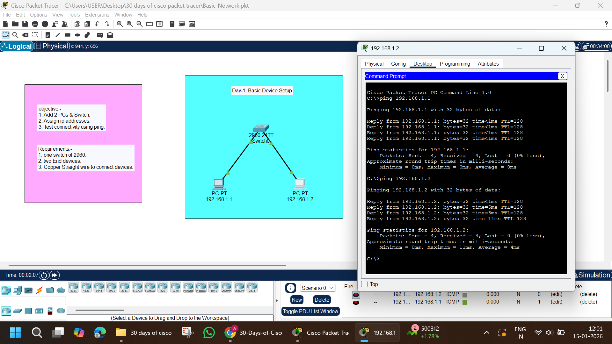

# Day 01 – Basic Network Setup

## Objective
Create a simple LAN using a switch and two PCs and test connectivity.

## Topology
PC1 — Switch — PC2

## IP Configuration
PC1: 192.168.1.10 /24  
PC2: 192.168.1.20 /24  

## Task Performed
- Connected devices using copper straight-through cable
- Assigned IP addresses
- Tested connectivity using ping

## Result
Both PCs can successfully ping each other.

