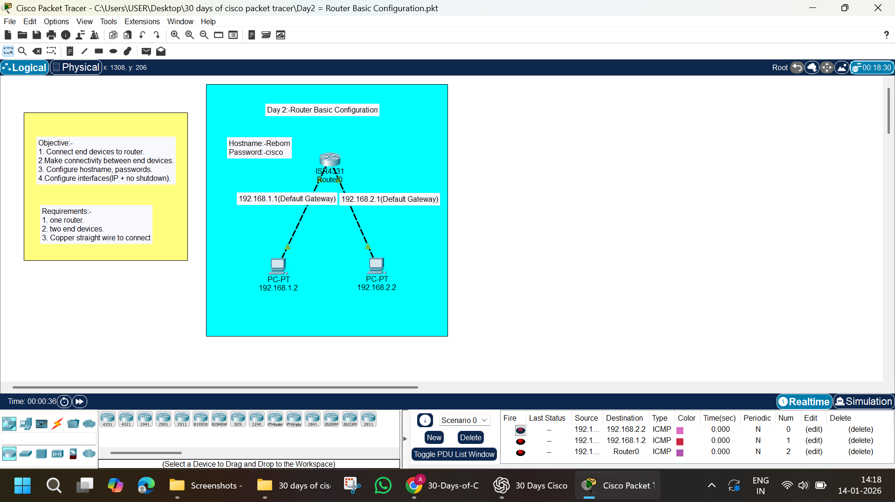

# Day 02 – Router Basic Configuration

## Lab Overview
This lab demonstrates basic router configuration and communication between two different IP networks using a single router. It covers essential CCNA fundamentals such as interface configuration, IP addressing, and connectivity verification.

---

## Objectives
- Connect end devices to a router  
- Configure router hostname and password  
- Assign IP addresses to router interfaces  
- Enable router interfaces using `no shutdown`  
- Establish connectivity between different networks  

---

## Network Topology
Two PCs connected to a router, each in a different network.



---

## Devices Used
- 1 × Cisco ISR4331 Router  
- 2 × PCs  
- Copper Straight-Through Cables  

---

## IP Addressing Scheme

### Router Interface Configuration

| Interface | IP Address | Subnet Mask | Description |
|---------|-----------|-------------|------------|
| G0/0/0 | 192.168.1.1 | 255.255.255.0 | Default Gateway for PC1 |
| G0/0/1 | 192.168.2.1 | 255.255.255.0 | Default Gateway for PC2 |

### PC Configuration

| Device | IP Address | Subnet Mask | Default Gateway |
|------|-----------|-------------|----------------|
| PC1 | 192.168.1.2 | 255.255.255.0 | 192.168.1.1 |
| PC2 | 192.168.2.2 | 255.255.255.0 | 192.168.2.1 |

---

## Router Basic Configuration

```bash
enable
configure terminal
hostname Reborn
enable password cisco
no ip domain-lookup
banner motd # Unauthorized access is prohibited #
exit
```

---

## Interface Configuration

```bash
interface gigabitEthernet0/0/0
ip address 192.168.1.1 255.255.255.0
no shutdown
exit

interface gigabitEthernet0/0/1
ip address 192.168.2.1 255.255.255.0
no shutdown
exit
```

---

## Verification Commands

```bash
show ip interface brief
ping 192.168.2.2
ping 192.168.1.2
```

Expected Result:  
All interfaces should be **up/up**, and ping should be **successful**.

---

## Tasks Performed
- Connected PCs to the router  
- Configured router hostname and password  
- Assigned IP addresses to router interfaces  
- Enabled interfaces using `no shutdown`  
- Configured default gateways on PCs  
- Verified connectivity using ICMP  

---

## Result
Successful communication between two different networks using a single router.

---

## Key Learning Outcomes
- Router basic configuration
- Interface IP assignment
- Default gateway importance
- Inter-network communication

---

✅ **Status:** Completed  
📘 **Level:** Beginner (CCNA Fundamentals)
