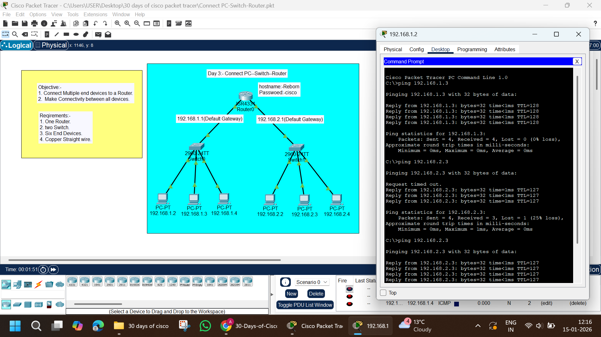

# Day 03 – Connect PC–Switch–Router (Cisco Packet Tracer)

## Description
This lab demonstrates how to connect multiple PCs to a router using switches in Cisco Packet Tracer. Two separate LANs are created, and routing is configured to enable communication between them.

---

## Objectives
- Connect multiple end devices to a router
- Use switches to extend LAN connectivity
- Configure router hostname and password
- Assign IP addresses to router interfaces
- Configure default gateways on PCs
- Verify connectivity between all devices

---

## Requirements
- 1 × Cisco ISR4331 Router
- 2 × Cisco 2960 Switches
- 6 × PCs
- Copper Straight-Through Cables
- Cisco Packet Tracer

---

## Network Topology
Two LANs connected to a single router through switches.



---

## Network Design

### LAN 1
- Network: 192.168.1.0/24
- Default Gateway: 192.168.1.1

### LAN 2
- Network: 192.168.2.0/24
- Default Gateway: 192.168.2.1

---

## IP Addressing Scheme

### Router Interfaces

| Interface | IP Address | Subnet Mask |
|---------|-----------|-------------|
| G0/0/0 | 192.168.1.1 | 255.255.255.0 |
| G0/0/1 | 192.168.2.1 | 255.255.255.0 |

---

### LAN 1 PCs

| Device | IP Address | Subnet Mask | Gateway |
|------|-----------|-------------|---------|
| PC1 | 192.168.1.2 | 255.255.255.0 | 192.168.1.1 |
| PC2 | 192.168.1.3 | 255.255.255.0 | 192.168.1.1 |
| PC3 | 192.168.1.4 | 255.255.255.0 | 192.168.1.1 |

---

### LAN 2 PCs

| Device | IP Address | Subnet Mask | Gateway |
|------|-----------|-------------|---------|
| PC4 | 192.168.2.2 | 255.255.255.0 | 192.168.2.1 |
| PC5 | 192.168.2.3 | 255.255.255.0 | 192.168.2.1 |
| PC6 | 192.168.2.4 | 255.255.255.0 | 192.168.2.1 |

---

## Router Configuration

```bash
enable
configure terminal
hostname Reborn
enable password cisco
no ip domain-lookup

interface gigabitEthernet0/0/0
ip address 192.168.1.1 255.255.255.0
no shutdown
exit

interface gigabitEthernet0/0/1
ip address 192.168.2.1 255.255.255.0
no shutdown
exit
```

## Tasks Performed

Connected PCs to switches
- Connected switches to router
- Configured router hostname and password
- Assigned IP addresses to router interfaces
- Configured IP addresses and default gateways on PCs
- Verified connectivity using ping

## Result

All PCs successfully communicate with each other across different networks.

## Files Included

- Connect-PC-Switch-Router.pkt
- image.png
- README.md

## Key Learning Outcomes

- PC–Switch–Router topology
- Role of switches in LAN expansion
- Router as default gateway
- Basic inter-network routing
- CCNA-level practical networking skills

## Status

- Lab Completed Successfully
- Difficulty Level: Beginner to Intermediate (CCNA)

## Author

- Abhishek Pundir
- 30 Days of Cisco Packet Tracer
