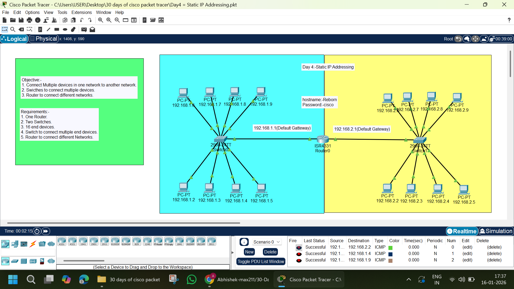

# 🌐 Day 4 – Static IP Addressing | Cisco Packet Tracer


## 📌 Project Overview
This project demonstrates **Static IP Addressing** using Cisco Packet Tracer.  
Two different networks are connected using a **router**, and multiple end devices are connected via **switches**.  
All PCs are configured with **manual (static) IP addresses**, and connectivity is verified using **ICMP (ping)**.

This lab is part of my **30 Days of Cisco Packet Tracer Challenge** to build strong **CCNA-level networking fundamentals**.

---



---

## 🎯 Objectives
- Connect multiple devices within a LAN
- Connect two different networks using a router
- Configure static IP addresses on end devices
- Configure default gateways
- Test connectivity using ping

---

## 🧰 Network Requirements
- 1 × Router (ISR 4331)
- 2 × Switches (Cisco 2960)
- 16 × PCs
- Copper Straight-Through cables

---

## 🗺️ Network Topology Details
- **Network 1:** `192.168.1.0/24`
- **Network 2:** `192.168.2.0/24`
- Router acts as the default gateway for both networks
- Switches are used to connect multiple end devices

---

## 🖥️ IP Addressing Scheme

### 🔹 Network 1 (192.168.1.0/24)
| Device | IP Address | Subnet Mask | Default Gateway |
|------|------------|-------------|-----------------|
| PC1 | 192.168.1.2 | 255.255.255.0 | 192.168.1.1 |
| PC2 | 192.168.1.3 | 255.255.255.0 | 192.168.1.1 |
| PC3 | 192.168.1.4 | 255.255.255.0 | 192.168.1.1 |
| PC4 | 192.168.1.5 | 255.255.255.0 | 192.168.1.1 |
| PC5 | 192.168.1.6 | 255.255.255.0 | 192.168.1.1 |
| PC6 | 192.168.1.7 | 255.255.255.0 | 192.168.1.1 |
| PC7 | 192.168.1.8 | 255.255.255.0 | 192.168.1.1 |
| PC8 | 192.168.1.9 | 255.255.255.0 | 192.168.1.1 |

---

### 🔹 Network 2 (192.168.2.0/24)
| Device | IP Address | Subnet Mask | Default Gateway |
|------|------------|-------------|-----------------|
| PC9 | 192.168.2.2 | 255.255.255.0 | 192.168.2.1 |
| PC10 | 192.168.2.3 | 255.255.255.0 | 192.168.2.1 |
| PC11 | 192.168.2.4 | 255.255.255.0 | 192.168.2.1 |
| PC12 | 192.168.2.5 | 255.255.255.0 | 192.168.2.1 |
| PC13 | 192.168.2.6 | 255.255.255.0 | 192.168.2.1 |
| PC14 | 192.168.2.7 | 255.255.255.0 | 192.168.2.1 |
| PC15 | 192.168.2.8 | 255.255.255.0 | 192.168.2.1 |
| PC16 | 192.168.2.9 | 255.255.255.0 | 192.168.2.1 |

---

## ⚙️ Router Configuration (ISR 4331)

```bash
enable
configure terminal

hostname Reborn
enable secret cisco

interface GigabitEthernet0/0/0
 ip address 192.168.1.1 255.255.255.0
 no shutdown

interface GigabitEthernet0/0/1
 ip address 192.168.2.1 255.255.255.0
 no shutdown

end
write memory
```

### 🧑‍💻 Author

- Abhishek Pundir
- B.Tech | Networking & CCNA Aspirant
