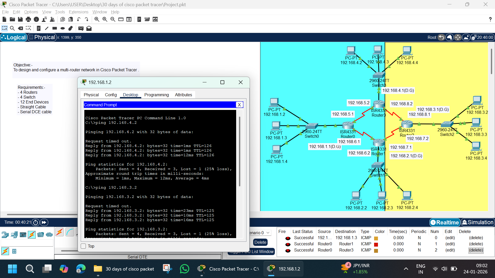

# 🌐 Multi-Router Network Design | Cisco Packet Tracer Project

---

## 📌 Project Overview
This project demonstrates the **design and configuration of a multi-router network** using Cisco Packet Tracer.  
Multiple LANs are interconnected through **four routers** using **serial DCE links and static routing**, allowing full end-to-end connectivity between all devices.

This project is part of my **30 Days of Cisco Packet Tracer Challenge** and represents an **advanced CCNA-level implementation**.

---

## 🎯 Objectives
- Design a multi-router network topology
- Configure routers, switches, and end devices
- Implement static routing between all networks
- Ensure inter-network communication
- Verify connectivity using ICMP (ping)

---

## 🧰 Network Requirements
- 4 × Routers (ISR 4331)
- 4 × Switches (Cisco 2960)
- 12 × End Devices (PCs)
- Copper Straight-Through Cables (PC ↔ Switch, Switch ↔ Router)
- Serial DCE Cables (Router ↔ Router)

---

## 🗺️ Network Topology Description
- Each router connects to one LAN via a switch
- Routers are interconnected using serial links
- Each LAN uses a different IP network
- Static routing enables communication between all LANs

---

## 🖥️ IP Addressing Scheme

### 🔹 LAN Networks

| LAN | Network | Default Gateway |
|---|---|---|
| LAN 1 | 192.168.1.0/24 | 192.168.1.1 |
| LAN 2 | 192.168.2.0/24 | 192.168.2.1 |
| LAN 3 | 192.168.3.0/24 | 192.168.3.1 |
| LAN 4 | 192.168.4.0/24 | 192.168.4.1 |

---

### 🔹 Sample End Device IPs

**LAN 1**
- PC1: 192.168.1.2
- PC2: 192.168.1.3
- PC3: 192.168.1.4

**LAN 2**
- PC4: 192.168.2.2
- PC5: 192.168.2.3
- PC6: 192.168.2.4

**LAN 3**
- PC7: 192.168.3.2
- PC8: 192.168.3.3
- PC9: 192.168.3.4

**LAN 4**
- PC10: 192.168.4.2
- PC11: 192.168.4.3
- PC12: 192.168.4.4

---

## 🔗 Serial Link Networks

| Router Link | Network |
|-----------|--------|
| Router0 ↔ Router3 | 192.168.5.0/30 |
| Router0 ↔ Router1 | 192.168.6.0/30 |
| Router1 ↔ Router2 | 192.168.7.0/30 |
| Router2 ↔ Router3 | 192.168.8.0/30 |

---

## ⚙️ Routing Configuration
- Static routes configured on each router
- Each router has routes to all remote LANs
- Serial interfaces configured with DCE clock rate where required

---

## ✅ Verification & Testing
- Ping tested between:
  - PC (192.168.1.2) → PC (192.168.4.2)
  - PC (192.168.1.2) → PC (192.168.3.2)
- Router-to-router ICMP successful
- End-to-end connectivity confirmed with minimal packet loss

---

## 📚 Key Concepts Learned
- Multi-router network design
- Static routing configuration
- Serial DCE cable usage
- Default gateway importance
- ICMP troubleshooting
- Hierarchical network design

---

## 🚀 Future Enhancements
- Implement dynamic routing (RIP / OSPF / EIGRP)
- Add VLANs and trunking
- Configure DHCP instead of static IPs
- Apply ACLs for security
- Enable router redundancy

---

## 📁 Files Included
- `Project.pkt` – Cisco Packet Tracer project file
- `image.png` – Network topology screenshot
- `README.md` – Project documentation

---

## 🧑‍💻 Author
**Abhishek Pundir**  
B.Tech | Networking Enthusiast | CCNA Aspirant  

⭐ If you found this project helpful, consider giving the repository a star!
