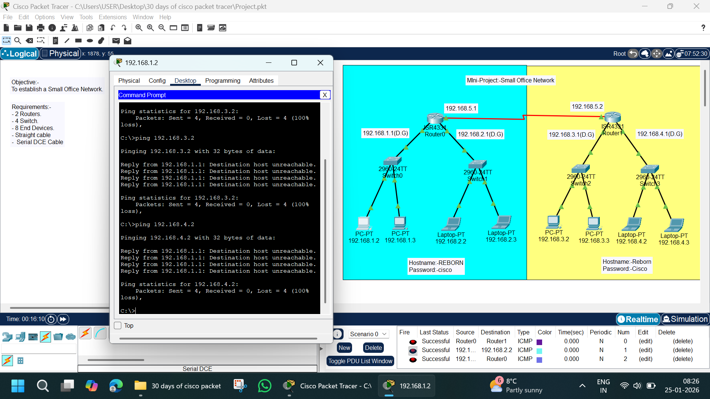

# 🏢 Mini Project – Small Office Network | Cisco Packet Tracer

---

## 📌 Project Overview
This mini project focuses on designing and configuring a **Small Office Network** using Cisco Packet Tracer.  
The network uses **two routers**, **multiple switches**, and **end devices** distributed across **four different LANs**.  
Routers are interconnected using **serial DCE links**, and static routing is required to enable communication between all networks.

This project is part of my **30 Days of Cisco Packet Tracer Challenge**.

---

## 🎯 Objectives
- Design a small office network architecture
- Configure routers and switches
- Assign static IP addresses to end devices
- Configure default gateways
- Connect multiple LANs using routers
- Test and troubleshoot network connectivity

---

## 🧰 Network Requirements
- 2 × Routers (ISR 4331)
- 4 × Switches (Cisco 2960)
- 8 × End Devices (PCs & Laptops)
- Copper Straight-Through Cables
- Serial DCE Cable (Router ↔ Router)

---

## 🗺️ Network Topology Description
- Each router connects to **two LANs** via switches
- Routers are connected using a **serial WAN link**
- Each LAN uses a **different IP subnet**
- Static routing is required for inter-network communication

---

## 🖥️ IP Addressing Scheme

### 🔹 LAN Networks & Gateways

| LAN | Network | Default Gateway |
|----|--------|----------------|
| LAN 1 | 192.168.1.0/24 | 192.168.1.1 |
| LAN 2 | 192.168.2.0/24 | 192.168.2.1 |
| LAN 3 | 192.168.3.0/24 | 192.168.3.1 |
| LAN 4 | 192.168.4.0/24 | 192.168.4.1 |

---

### 🔹 End Device IP Addresses

**LAN 1**
- PC: 192.168.1.2
- PC: 192.168.1.3

**LAN 2**
- Laptop: 192.168.2.2
- Laptop: 192.168.2.3

**LAN 3**
- PC: 192.168.3.2
- PC: 192.168.3.3

**LAN 4**
- Laptop: 192.168.4.2
- Laptop: 192.168.4.3

---

## 🔗 WAN / Serial Link

| Router Connection | IP Address |
|------------------|-----------|
| Router0 | 192.168.5.1 |
| Router1 | 192.168.5.2 |

- Serial DCE cable used
- Clock rate configured on DCE side

---

## ⚙️ Router Configuration Summary
- Hostname configured on both routers
- Console and enable passwords set
- Interfaces assigned IP addresses
- Interfaces enabled using `no shutdown`
- Static routes required for remote networks

---

## ❌ Connectivity Issue (Observed)
- Ping from **192.168.1.2 → 192.168.3.2 / 192.168.4.2** fails
- Error: **Destination host unreachable**
- Indicates **missing or incorrect static routing configuration**

---

## 🔍 Troubleshooting & Learning Outcome
- Verified physical connections
- Verified IP addressing and gateways
- Identified missing static routes
- Learned importance of routing table entries
- Understood inter-network packet flow

---

## 📚 Key Concepts Learned
- Small office network design
- Static IP addressing
- Default gateway configuration
- Serial DCE cable usage
- ICMP testing and troubleshooting
- Router-to-router communication

---

## 🚀 Future Improvements
- Add correct static routes to fix connectivity
- Replace static routing with dynamic routing (RIP / OSPF)
- Implement DHCP for IP assignment
- Add VLAN segmentation
- Apply ACLs for security

---

## 📁 Files Included
- `Small Office Network.pkt` – Cisco Packet Tracer file
- `image.png` – Network topology screenshot
- `README.md` – Project documentation

---

## 🧑‍💻 Author
**Abhishek Pundir**  
B.Tech | Networking & Cybersecurity Enthusiast  

⭐ If you found this project useful, give the repository a star!
