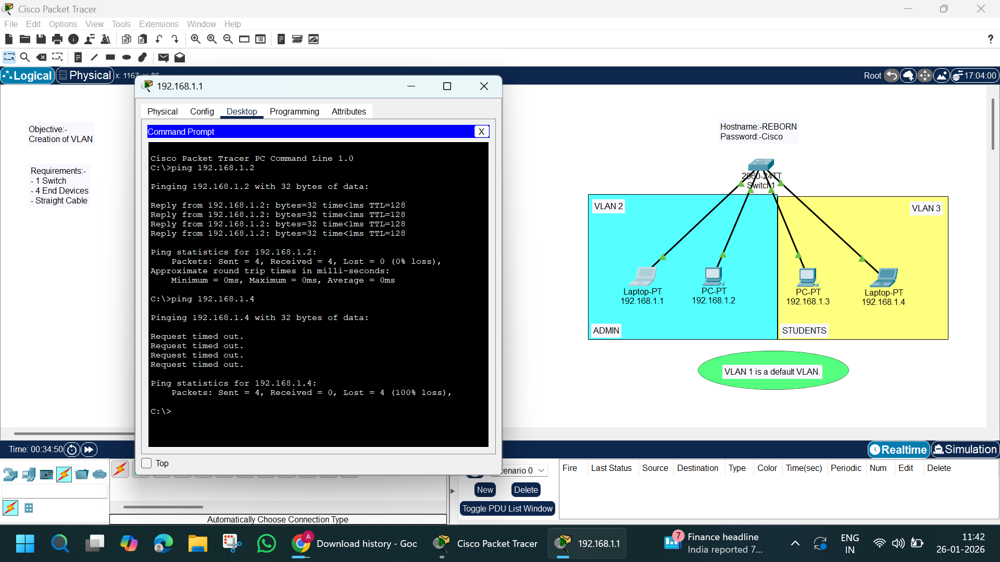

## 📌 Objective
To create and configure **VLANs** on a switch and verify **communication within the same VLAN** while **blocking communication between different VLANs**.

---

## 🧰 Tools Used
- Cisco Packet Tracer
- 1 × Cisco 2960 Switch
- 4 × End Devices (PCs & Laptops)
- Straight-through Ethernet Cables

---

## 🗂️ Network Topology



---

## 🧱 VLAN Design

| VLAN ID | VLAN Name  | Devices Included |
|-------|------------|------------------|
| 1     | Default    | System VLAN      |
| 2     | ADMIN      | Laptop-PT (192.168.1.1), PC-PT (192.168.1.2) |
| 3     | STUDENTS   | PC-PT (192.168.1.3), Laptop-PT (192.168.1.4) |

---

## 🌐 IP Address Configuration

### VLAN 2 – ADMIN
| Device | IP Address | Subnet Mask |
|------|-----------|-------------|
| Laptop-PT | 192.168.1.1 | 255.255.255.0 |
| PC-PT     | 192.168.1.2 | 255.255.255.0 |

### VLAN 3 – STUDENTS
| Device | IP Address | Subnet Mask |
|------|-----------|-------------|
| PC-PT     | 192.168.1.3 | 255.255.255.0 |
| Laptop-PT | 192.168.1.4 | 255.255.255.0 |

---

## ⚙️ Switch Configuration (Commands Used)

```bash
enable
configure terminal

vlan 2
name ADMIN
exit

vlan 3
name STUDENTS
exit

interface fastEthernet 0/1
switchport mode access
switchport access vlan 2
exit

interface fastEthernet 0/2
switchport mode access
switchport access vlan 2
exit

interface fastEthernet 0/3
switchport mode access
switchport access vlan 3
exit

interface fastEthernet 0/4
switchport mode access
switchport access vlan 3
exit

end
write memory
```
### 🧪 Testing & Verification

## ✅ Successful Communication (Same VLAN)

```bash
ping 192.168.1.2
```
- ✔ Ping successful between devices in VLAN 2

### ❌ Failed Communication (Different VLAN)

```bash
ping 192.168.1.4
```
- ❌ Request timed out (Expected behavior)

### 📊 Result

- Devices within the same VLAN can communicate
- Devices in different VLANs cannot communicate
- VLAN segmentation works correctly

### 🧠 Key Learning Outcomes

- Understood VLAN concepts and isolation
- Configured VLANs on Cisco Switch
- Assigned ports to VLANs
- Verified VLAN behavior using ping tests

### 👨‍💻 Author

- Abhishek Pundir
- B.Tech | Networking & CCNA Aspirant
- 30 Days of Cisco Packet Tracer Challenge 🚀
