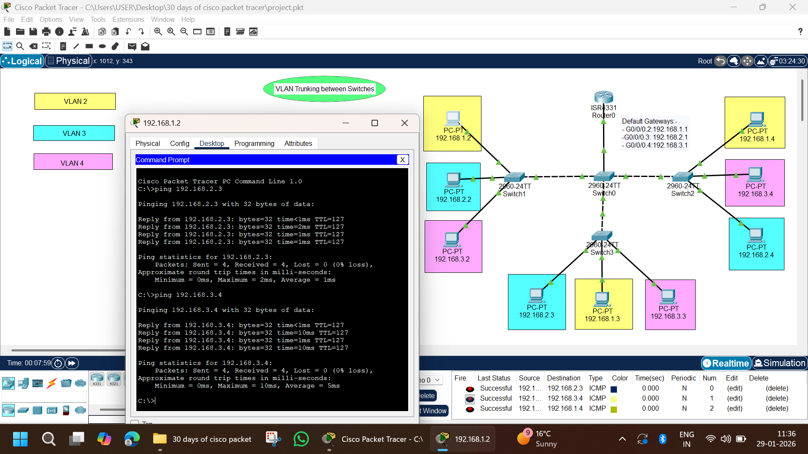

# VLAN Trunking Between Switches with Inter-VLAN Routing

## 📌 Objective
To configure **VLAN Trunking between multiple switches** and enable **Inter-VLAN communication using Router-on-a-Stick** in Cisco Packet Tracer.

---

## 🧰 Tools & Technologies Used
- Cisco Packet Tracer
- Cisco ISR4331 Router
- Cisco 2960 Switches
- VLAN Configuration
- Trunking (IEEE 802.1Q)
- Inter-VLAN Routing
- ICMP (Ping) Testing

---

## 🖧 Network Topology



---

## 📋 Network Requirements
- 1 × Router (ISR4331)
- 4 × Switches (2960-24TT)
- 9 × End Devices (PCs)
- Straight-through Cables (PC to Switch)
- Cross-over / Trunk Links (Switch to Switch)

---

## 🗂️ VLAN Information

| VLAN ID | VLAN Name |
|-------|----------|
| 2 | VLAN 2 |
| 3 | VLAN 3 |
| 4 | VLAN 4 |

---

## 🌐 IP Addressing Scheme

### 🔹 VLAN 2 – 192.168.1.0/24

| Device | IP Address | Gateway |
|------|-----------|--------|
| PC-PT | 192.168.1.2 | 192.168.1.1 |
| PC-PT | 192.168.1.3 | 192.168.1.1 |
| PC-PT | 192.168.1.4 | 192.168.1.1 |

---

### 🔹 VLAN 3 – 192.168.2.0/24

| Device | IP Address | Gateway |
|------|-----------|--------|
| PC-PT | 192.168.2.2 | 192.168.2.1 |
| PC-PT | 192.168.2.3 | 192.168.2.1 |
| PC-PT | 192.168.2.4 | 192.168.2.1 |

---

### 🔹 VLAN 4 – 192.168.3.0/24

| Device | IP Address | Gateway |
|------|-----------|--------|
| PC-PT | 192.168.3.2 | 192.168.3.1 |
| PC-PT | 192.168.3.3 | 192.168.3.1 |
| PC-PT | 192.168.3.4 | 192.168.3.1 |

---

## ⚙️ Switch Configuration

### 🔹 Step 1: Create VLANs (On All Switches)

```bash
enable
configure terminal

vlan 2
name VLAN2
exit

vlan 3
name VLAN3
exit

vlan 4
name VLAN4
exit
```

### 🔹 Step 2: Assign Access Ports

```bash
interface fastEthernet 0/1
switchport mode access
switchport access vlan 2
exit

interface fastEthernet 0/2
switchport mode access
switchport access vlan 3
exit

interface fastEthernet 0/3
switchport mode access
switchport access vlan 4
exit
```

### 🔹 Step 3: Configure Trunk Ports (Between Switches & Router)

```bash
interface fastEthernet 0/24
switchport mode trunk
exit
```
- Trunk links carry VLANs 2, 3, and 4 between switches and the router.

### ⚙️ Router Configuration (Router-on-a-Stick)

```bash
enable
configure terminal

interface g0/0/0
no shutdown
exit

interface g0/0/0.2
encapsulation dot1Q 2
ip address 192.168.1.1 255.255.255.0
exit

interface g0/0/0.3
encapsulation dot1Q 3
ip address 192.168.2.1 255.255.255.0
exit

interface g0/0/0.4
encapsulation dot1Q 4
ip address 192.168.3.1 255.255.255.0
exit
```

### 🧪 Testing & Verification
- ✅ Same VLAN Communication
```bash
ping 192.168.2.3
```
- ✔ Successful reply

### ✅ Inter-VLAN Communication
```bash
ping 192.168.3.4
```
- ✔ Successful reply via router

### 📊 Results
VLANs successfully created and isolated

- Trunking enabled between switches
- Router-on-a-Stick configured correctly
- Inter-VLAN routing working
- End-to-end connectivity verified using ICMP

### 🧠 Key Learning Outcomes

- VLAN creation and management
- Switch-to-switch trunking
- Router-on-a-Stick concept
- Sub-interface configuration
- Real-world campus network design

### 🚀 Project Status
- ✅ Completed Successfully

### 👨‍💻 Author

- Abhishek Pundir
- B.Tech | Networking & Cybersecurity Enthusiast
- 30 Days of Cisco Packet Tracer Challenge 🚀
