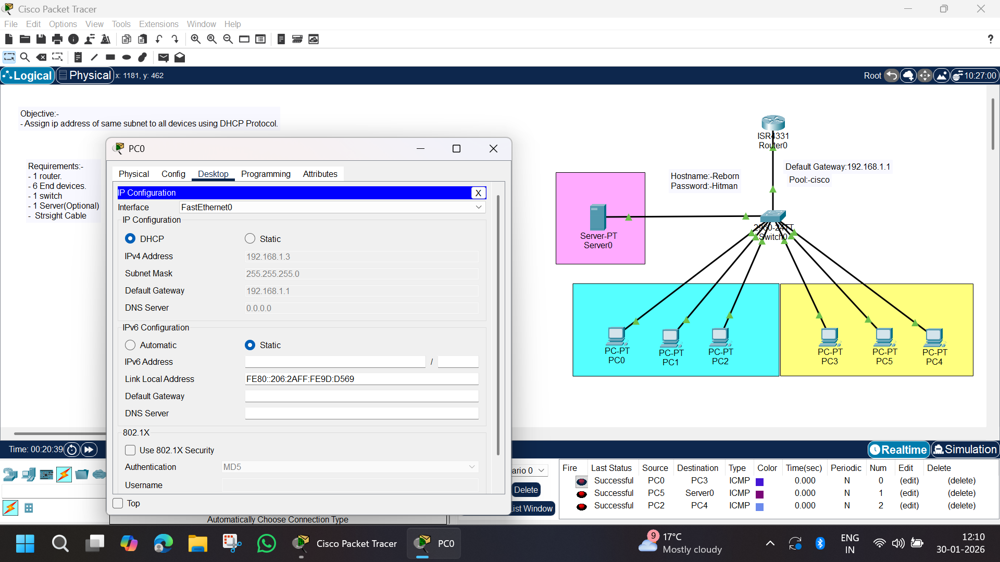

# DHCP Configuration in Single Subnet | Cisco Packet Tracer

## 📌 Objective
To **assign IP addresses automatically to all end devices in the same subnet using the DHCP protocol** and verify network connectivity using ICMP (ping).

---

## 🧰 Tools & Technologies Used
- Cisco Packet Tracer
- Cisco ISR4331 Router
- Cisco 2960 Switch
- DHCP Protocol
- IPv4 Addressing
- ICMP (Ping)

---

## 🖧 Network Topology



---

## 📋 Network Requirements
- 1 × Router (ISR4331)
- 1 × Switch (2960-24TT)
- 1 × Server (DHCP Server)
- 6 × End Devices (PCs)
- Straight-Through Cables

---

## 🌐 Network Design Overview
- All devices are connected to a **single switch**
- Router acts as the **default gateway**
- Server provides **DHCP services**
- All PCs receive IP addresses **automatically**
- Network operates in **one subnet**

---

## 📑 IP Addressing Scheme

### 🔹 Network
- Network: `192.168.1.0/24`
- Subnet Mask: `255.255.255.0`
- Default Gateway: `192.168.1.1`

---

### 🔹 DHCP Pool Configuration
| Parameter | Value |
|--------|------|
| Pool Name | cisco |
| Network | 192.168.1.0 |
| Subnet Mask | 255.255.255.0 |
| Default Gateway | 192.168.1.1 |
| DNS Server | Optional / Not Configured |

---

### 🔹 Dynamically Assigned IPs (Example)

| Device | IP Address |
|------|-----------|
| PC0 | 192.168.1.3 |
| PC1 | 192.168.1.4 |
| PC2 | 192.168.1.5 |
| PC3 | 192.168.1.6 |
| PC4 | 192.168.1.7 |
| PC5 | 192.168.1.8 |

*(IPs assigned automatically via DHCP)*

---

## ⚙️ Router Configuration

```bash
enable
configure terminal

interface g0/0/0
ip address 192.168.1.1 255.255.255.0
no shutdown
exit
```
### ⚙️ DHCP Server Configuration

- DHCP Service: Enabled
- Pool Name: cisco
- Default Gateway: 192.168.1.1
- Subnet Mask: 255.255.255.0
- Starting IP Address: 192.168.1.2

### 🖥️ PC Configuration

- Each PC is configured to receive an IP address automatically:
```bash
Desktop → IP Configuration → DHCP
```
- ✔ IP Address
- ✔ Subnet Mask
- ✔ Default Gateway
- assigned automatically

### 🧪 Testing & Verification

- 🔹 Ping Test (PC to PC)

```bash
ping 192.168.1.6
```
- ✔ Successful reply

- 🔹 Ping Test (PC to Server)
```bash
ping Server0
```
- ✔ Successful reply

### 📊 Results

- DHCP successfully assigned IP addresses
- All devices are in the same subnet
- Router functions as default gateway
- Full end-to-end connectivity verified
- Network operates without manual IP configuration

### 🧠 Key Learning Outcomes

DHCP server configuration

- Automatic IP addressing
- Default gateway concept
- Single subnet network design
- ICMP-based connectivity testing

### 🚀 Project Status
- ✅ Completed Successfully

### 👨‍💻 Author

- Abhishek Pundir
- B.Tech | Networking & Cybersecurity Enthusiast
- 30 Days of Cisco Packet Tracer Challenge 🚀
