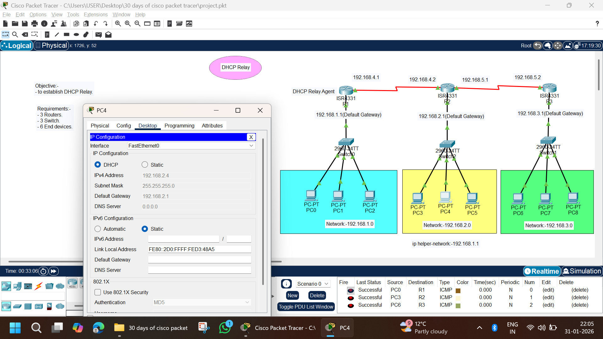

# DHCP Relay Configuration | Cisco Packet Tracer

## 📌 Objective
To configure **DHCP Relay Agent (ip helper-address)** so that multiple networks can obtain IP addresses from a **centralized DHCP server** across **multiple routers**.

---

## 🧰 Tools & Technologies Used
- Cisco Packet Tracer
- Cisco ISR 4331 Routers
- Cisco 2960 Switches
- DHCP Protocol
- DHCP Relay (ip helper-address)
- IPv4 Addressing
- ICMP (Ping)

---

## 🖧 Network Topology



---

## 📋 Network Requirements
- 3 × Routers (ISR4331)
- 3 × Switches (2960)
- 1 × DHCP Server
- 9 × End Devices (PCs)
- Straight-Through & Serial Cables

---

## 🌐 Network Design Overview
- One **central DHCP server** located in Network `192.168.1.0/24`
- Three different LANs connected via **three routers**
- Router **R1 acts as DHCP Relay Agent**
- Routers forward DHCP requests using **ip helper-address**
- All PCs receive IP addresses automatically

---

## 📑 IP Addressing Scheme

### 🔹 LAN Networks
| Network | Default Gateway |
|------|---------------|
| 192.168.1.0/24 | 192.168.1.1 |
| 192.168.2.0/24 | 192.168.2.1 |
| 192.168.3.0/24 | 192.168.3.1 |

---

### 🔹 Router Interconnections
| Link | IP Address |
|----|-----------|
| R1 – R2 | 192.168.4.1 / 192.168.4.2 |
| R2 – R3 | 192.168.5.1 / 192.168.5.2 |

---

## ⚙️ Router Configuration

### 🔹 R1 (DHCP Relay Agent)
```bash
enable
configure terminal

interface g0/0/0
ip address 192.168.1.1 255.255.255.0
no shutdown

interface s0/0/0
ip address 192.168.4.1 255.255.255.0
no shutdown

ip route 192.168.2.0 255.255.255.0 192.168.4.2
ip route 192.168.3.0 255.255.255.0 192.168.4.2
```
### 🔹 R2
```bash
enable
configure terminal

interface g0/0/0
ip address 192.168.2.1 255.255.255.0
ip helper-address 192.168.1.1
no shutdown

interface s0/0/0
ip address 192.168.4.2 255.255.255.0
no shutdown

interface s0/0/1
ip address 192.168.5.1 255.255.255.0
no shutdown

ip route 192.168.1.0 255.255.255.0 192.168.4.1
ip route 192.168.3.0 255.255.255.0 192.168.5.2
```
###  🔹 R3
```bash
enable
configure terminal

interface g0/0/0
ip address 192.168.3.1 255.255.255.0
ip helper-address 192.168.1.1
no shutdown

interface s0/0/0
ip address 192.168.5.2 255.255.255.0
no shutdown

ip route 192.168.1.0 255.255.255.0 192.168.5.1
ip route 192.168.2.0 255.255.255.0 192.168.5.1
```
### ⚙️ DHCP Server Configuration
DHCP Service: Enabled

- Pools Created:
- 192.168.1.0 /24
- 192.168.2.0 /24
- 192.168.3.0 /24
- Default Gateway configured per network
- DNS Server: Optional

### 🖥️ PC Configuration
- All PCs are set to DHCP mode:
```bash
Desktop → IP Configuration → DHCP
```
- ✔ IP Address
- ✔ Subnet Mask
- ✔ Default Gateway
- assigned automatically

### 🧪 Testing & Verification
- 🔹 Ping Tests
```bash
ping 192.168.2.1
ping 192.168.3.1
```
- ✔ Successful replies from all networks
- ✔ DHCP Relay functioning correctly
- ✔ Inter-network communication verified

### 📊 Results

- DHCP requests successfully forwarded using ip helper-address
- All PCs received valid IP addresses
- Routers correctly routed DHCP and ICMP traffic
- Multi-network connectivity achieved

🧠 Key Learning Outcomes

- DHCP Relay Agent configuration
- ip helper-address usage
- Multi-router routing
- Centralized DHCP deployment
- Real-world enterprise network design

### 🚀 Project Status
- ✅ Completed Successfully

### 👨‍💻 Author

- Abhishek Pundir
- B.Tech | Networking & Cybersecurity
- 30 Days of Cisco Packet Tracer Challenge 🚀
