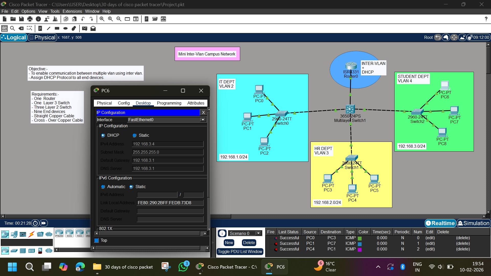

# Mini Campus Network | Inter-VLAN Routing + DHCP | Cisco Packet Tracer

## 📌 Objective
- Enable communication between multiple VLANs using **Inter-VLAN Routing**
- Assign IP addresses dynamically using **DHCP**
- Simulate a real-world campus network design

---

## 🏢 Network Overview

This project simulates a **Mini Campus Network** with three departments:

- 🖥 IT Department (VLAN 2)
- 🏢 HR Department (VLAN 3)
- 🎓 Student Department (VLAN 4)

Each department is placed in a separate VLAN and subnet.  
A Layer 3 Switch performs **Inter-VLAN Routing**, and a Router provides **DHCP services**.

---

## 🖼 Network Topology



---

## 🧰 Devices Used

- 1 × Router (ISR 4331)
- 1 × Layer 3 Switch (3650-24PS)
- 2 × Layer 2 Switches (2960-24TT)
- 9 × PCs
- Straight-through & Cross-over cables

---

## 🌐 VLAN & IP Addressing Scheme

| Department | VLAN ID | Network | Default Gateway |
|------------|----------|------------|----------------|
| IT Dept | VLAN 2 | 192.168.1.0/24 | 192.168.1.1 |
| HR Dept | VLAN 3 | 192.168.2.0/24 | 192.168.2.1 |
| Student Dept | VLAN 4 | 192.168.3.0/24 | 192.168.3.1 |

---

## ⚙️ Layer 3 Switch Configuration (Inter-VLAN Routing)

```bash
enable
configure terminal

vlan 2
name IT_DEPT

vlan 3
name HR_DEPT

vlan 4
name STUDENT_DEPT

interface vlan 2
ip address 192.168.1.1 255.255.255.0
no shutdown

interface vlan 3
ip address 192.168.2.1 255.255.255.0
no shutdown

interface vlan 4
ip address 192.168.3.1 255.255.255.0
no shutdown
```

### ⚙️ Router Configuration (DHCP Server)
```bash
enable
configure terminal

ip dhcp pool VLAN2
network 192.168.1.0 255.255.255.0
default-router 192.168.1.1
dns-server 8.8.8.8

ip dhcp pool VLAN3
network 192.168.2.0 255.255.255.0
default-router 192.168.2.1
dns-server 8.8.8.8

ip dhcp pool VLAN4
network 192.168.3.0 255.255.255.0
default-router 192.168.3.1
dns-server 8.8.8.8
```

### ⚙️ Access Port Configuration (Layer 2 Switch Example)
## VLAN 2 (IT Department)
```bash
interface range fa0/1 - 3
switchport mode access
switchport access vlan 2
```
## VLAN 3 (HR Department)
```bash
interface range fa0/4 - 6
switchport mode access
switchport access vlan 3
```
### VLAN 4 (Student Department)
```bash
interface range fa0/7 - 9
switchport mode access
switchport access vlan 4
```

### 🔗 Trunk Configuration
```bash
interface g0/1
switchport mode trunk
```
### 🖥 PC Configuration
- All PCs are configured to:
```bash
Desktop → IP Configuration → DHCP
```
- ✔ IP Address assigned automatically
- ✔ Subnet Mask assigned automatically
- ✔ Default Gateway assigned automatically

### 🧪 Testing & Verification
- Ping Tests Performed:
```bash
PC0 → PC3
PC1 → PC7
PC4 → PC1
```
- ✔ Successful Inter-VLAN Communication
- ✔ DHCP working correctly
- ✔ Layer 3 routing verified

### 📊 Results

- Inter-VLAN routing successfully implemented
- DHCP automatically assigns IP addresses to all VLANs
- All departments can communicate with each other
- Campus-style network simulated successfully

### 🧠 Key Concepts Learned

- VLAN creation and segmentation
- Access & trunk port configuration
- Layer 3 switching
- Inter-VLAN Routing
- DHCP configuration
- Campus network architecture design

### 🚀 Project Status

- ✅ Completed Successfully

### 👨‍💻 Author

- Abhishek Pundir
- B.Tech Engineering Student
- Networking & Cybersecurity Enthusiast
- 30 Days of Cisco Packet Tracer Challenge 🚀
