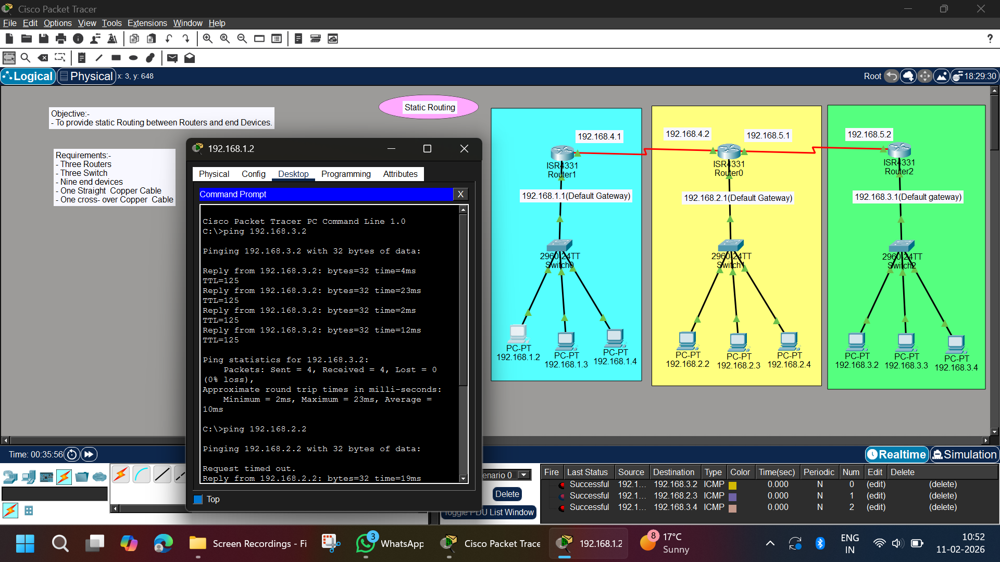

# Static Routing Between Three Routers | Cisco Packet Tracer

## 📌 Objective
To configure **Static Routing** between three routers and enable communication between different networks.

---

## 🏗 Network Overview

This project demonstrates static routing in a multi-router environment.

The topology consists of:

- 3 Routers (ISR 4331)
- 3 Switches (2960-24TT)
- 9 PCs
- Multiple interconnected networks

Each router connects to a different LAN and is manually configured with static routes to reach remote networks.

---

## 🖼 Network Topology



---

## 🌐 IP Addressing Scheme

### 🔹 LAN 1 (Router1)
- Network: 192.168.1.0/24
- Default Gateway: 192.168.1.1
- PCs:
  - 192.168.1.2
  - 192.168.1.3
  - 192.168.1.4

### 🔹 LAN 2 (Router0)
- Network: 192.168.2.0/24
- Default Gateway: 192.168.2.1
- PCs:
  - 192.168.2.2
  - 192.168.2.3
  - 192.168.2.4

### 🔹 LAN 3 (Router2)
- Network: 192.168.3.0/24
- Default Gateway: 192.168.3.1
- PCs:
  - 192.168.3.2
  - 192.168.3.3
  - 192.168.3.4

---

## 🔗 Router-to-Router Networks

| Connection | Network |
|------------|----------|
| Router1 ↔ Router0 | 192.168.4.0/24 |
| Router0 ↔ Router2 | 192.168.5.0/24 |

---

## ⚙️ Router Configuration

---

### 🔹 Router1 Configuration

```bash
enable
configure terminal

interface g0/0/0
ip address 192.168.1.1 255.255.255.0
no shutdown

interface g0/0/1
ip address 192.168.4.1 255.255.255.0
no shutdown

ip route 192.168.2.0 255.255.255.0 192.168.4.2
ip route 192.168.3.0 255.255.255.0 192.168.4.2
```

### 🔹 Router0 Configuration
```bash
enable
configure terminal

interface g0/0/0
ip address 192.168.2.1 255.255.255.0
no shutdown

interface g0/0/1
ip address 192.168.4.2 255.255.255.0
no shutdown

interface g0/0/2
ip address 192.168.5.1 255.255.255.0
no shutdown

ip route 192.168.1.0 255.255.255.0 192.168.4.1
ip route 192.168.3.0 255.255.255.0 192.168.5.2
```

### 🔹 Router2 Configuration
```bash
enable
configure terminal

interface g0/0/0
ip address 192.168.3.1 255.255.255.0
no shutdown

interface g0/0/1
ip address 192.168.5.2 255.255.255.0
no shutdown

ip route 192.168.1.0 255.255.255.0 192.168.5.1
ip route 192.168.2.0 255.255.255.0 192.168.5.1
```
### 🖥 PC Configuration

- Each PC is configured manually with:
- IP Address
- Subnet Mask: 255.255.255.0
- Default Gateway (Router LAN IP)

### 🧪 Testing & Verification

```bash
PC (192.168.1.2) → 192.168.3.2
PC (192.168.1.2) → 192.168.2.2
```
- ✔ All networks successfully reachable
- ✔ Static routing working properly
- ✔ End-to-end communication verified

### 📊 Result

- Static routes successfully configured
- All three LAN networks can communicate
- Manual route configuration verified
- Routing table tested and validated

### 🧠 Concepts Learned

- Static Routing
- Multi-router network design
- Next-hop configuration
- IP addressing and subnetting
- Routing table behavior
- End-to-end connectivity testing

### 🚀 Project Status

- ✅ Completed Successfully

### 👨‍💻 Author

- Abhishek Pundir
- B.Tech Engineering Student
- Networking & Cybersecurity Enthusiast
- 30 Days of Cisco Packet Tracer Challenge 🚀
