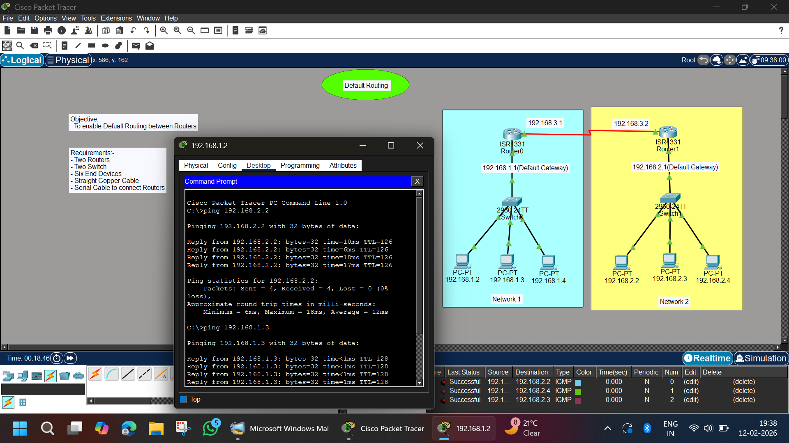

# Default Routing Between Two Routers | Cisco Packet Tracer

## 📌 Objective
To configure **Default Routing** between two routers and enable communication between two different networks using a single default route.

---

## 🏗 Network Overview

This project demonstrates how to configure **Default Static Routes (0.0.0.0/0)** between two routers.

The topology consists of:

- 2 Routers (ISR 4331)
- 2 Switches (2960-24TT)
- 6 PCs
- Serial connection between routers
- Two different LAN networks

Default routing is used instead of multiple static routes to simplify routing configuration.

---

## 🖼 Network Topology



---

## 🌐 IP Addressing Scheme

### 🔹 Network 1 (Left Side)

- Network: 192.168.1.0/24
- Default Gateway: 192.168.1.1
- PCs:
  - 192.168.1.2
  - 192.168.1.3
  - 192.168.1.4

Router0 LAN Interface:


---

### 🔹 Network 2 (Right Side)

- Network: 192.168.2.0/24
- Default Gateway: 192.168.2.1
- PCs:
  - 192.168.2.2
  - 192.168.2.3
  - 192.168.2.4

Router1 LAN Interface:


---

### 🔹 Router-to-Router Serial Network

| Router | IP Address |
|--------|------------|
| Router0 | 192.168.3.1 |
| Router1 | 192.168.3.2 |

Network: 192.168.3.0/24

---

## ⚙️ Router Configuration

---

### 🔹 Router0 Configuration

```bash
enable
configure terminal

interface g0/0/0
ip address 192.168.1.1 255.255.255.0
no shutdown

interface s0/0/0
ip address 192.168.3.1 255.255.255.0
clock rate 64000
no shutdown

ip route 0.0.0.0 0.0.0.0 192.168.3.2
```

### 🔹 Router1 Configuration
```bash
enable
configure terminal

interface g0/0/0
ip address 192.168.2.1 255.255.255.0
no shutdown

interface s0/0/0
ip address 192.168.3.2 255.255.255.0
no shutdown

ip route 0.0.0.0 0.0.0.0 192.168.3.1
```

### 🖥 PC Configuration

- Each PC is manually configured with:
- IP Address
- Subnet Mask: 255.255.255.0
- Default Gateway (Router LAN IP)

### 🧪 Verification & Testing

- Ping Tests Performed
- From Network 1:
```bash
ping 192.168.2.2
ping 192.168.2.3
```
- From Network 2:
```bash
ping 192.168.1.2
ping 192.168.1.3
```

### ✅ Results

- Successful replies received
- 0% packet loss
- End-to-end connectivity established
- Default route functioning properly

### 🧠 Concepts Learned

- Default Static Route
- 0.0.0.0 / 0 Routing
- Serial Interface Configuration
- Basic Network Design
- End-to-End Testing using ICMP
- Routing Table Analysis

### 🚀 Project Status

- ✅ Completed Successfully
- ✅ Default Routing Working
- ✅ Cross-Network Communication Verified

### 👨‍💻 Author

- Abhishek Pundir
- B.Tech Engineering Student
- Networking & Cybersecurity Enthusiast
- 30 Days of Cisco Packet Tracer Challenge 🚀
