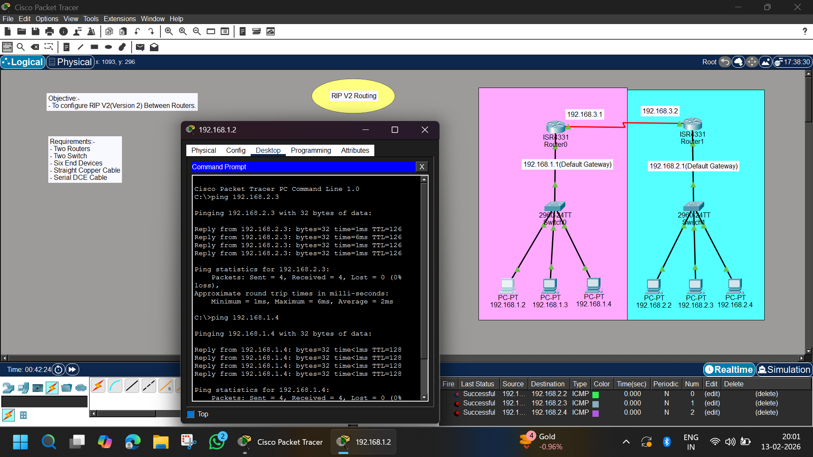

# RIP Version 2 (RIPv2) Routing Between Two Routers | Cisco Packet Tracer

## 📌 Objective

To configure **RIP Version 2 (RIPv2)** dynamic routing between two routers and enable communication between two different LAN networks.

---

## 🏗 Network Overview

This project demonstrates how to configure **RIP Version 2** as a dynamic routing protocol between two routers.

The topology includes:

- 2 Routers (ISR 4331)
- 2 Switches (2960-24TT)
- 6 PCs
- Serial DCE connection between routers
- Two separate LAN networks

RIPv2 is used instead of static routing to allow automatic route exchange between routers.

---

## 🖼 Network Topology



---

## 🌐 IP Addressing Scheme

### 🔹 Network 1 (Left Side)

- Network: 192.168.1.0/24
- Default Gateway: 192.168.1.1
- PCs:
  - 192.168.1.2
  - 192.168.1.3
  - 192.168.1.4

Router0 LAN Interface:
---

### 🔹 Network 2 (Right Side)

- Network: 192.168.2.0/24
- Default Gateway: 192.168.2.1
- PCs:
  - 192.168.2.2
  - 192.168.2.3
  - 192.168.2.4

Router1 LAN Interface:

---

### 🔹 Router-to-Router Serial Network

| Router | IP Address |
|--------|------------|
| Router0 | 192.168.3.1 |
| Router1 | 192.168.3.2 |

Network: 192.168.3.0/24

---

## ⚙️ Router Configuration

---

### 🔹 Router0 Configuration

```bash
enable
configure terminal

interface g0/0/0
ip address 192.168.1.1 255.255.255.0
no shutdown

interface s0/0/0
ip address 192.168.3.1 255.255.255.0
clock rate 64000
no shutdown

router rip
version 2
no auto-summary
network 192.168.1.0
network 192.168.3.0
```

### 🔹 Router1 Configuration
```bash
enable
configure terminal

interface g0/0/0
ip address 192.168.2.1 255.255.255.0
no shutdown

interface s0/0/0
ip address 192.168.3.2 255.255.255.0
no shutdown

router rip
version 2
no auto-summary
network 192.168.2.0
network 192.168.3.0
```

### 🖥 PC Configuration

- Each PC is manually configured with:
- IP Address
- Subnet Mask: 255.255.255.0
- Default Gateway

## Example (Network 1 PC)
```bash
IP Address: 192.168.1.2
Subnet Mask: 255.255.255.0
Default Gateway: 192.168.1.1
```

## Example (Network 2 PC)
```bash
IP Address: 192.168.2.2
Subnet Mask: 255.255.255.0
Default Gateway: 192.168.2.1
```

### ✅ Results

- Successful ping responses
- 0% packet loss
- Automatic route exchange verified
- RIPv2 working properly
- Inter-network communication established

### 🧠 Concepts Learned

- Dynamic Routing
- RIP Version 2
- Classless Routing
- no auto-summary
- Serial Interface Configuration
- Routing Table Analysis
- Distance Vector Routing Protocol
- Hop Count Metric

### 🚀 Project Status

- ✅ Completed Successfully
- ✅ Dynamic Routing Working
- ✅ End-to-End Connectivity Verified
- ✅ RIP Routes Visible in Routing Table

### 👨‍💻 Author

- Abhishek Pundir
- B.Tech Engineering Student
- Networking & Cybersecurity Enthusiast
- 30 Days of Cisco Packet Tracer Challenge 🚀

