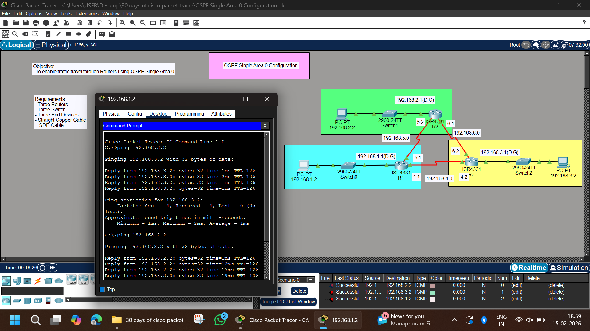

# 🌐 OSPF Single Area 0 Configuration




---

## 📌 Objective
To enable traffic travel between routers using OSPF Single Area 0 and verify full connectivity between all LAN networks.

---

## 🧰 Requirements
- Three Routers (ISR4331)
- Three Switches (2960-24TT)
- Three End Devices (PCs)
- Straight Through Copper Cable
- Serial DCE Cable
- Cisco Packet Tracer

---

## 🌐 Network Topology
The network consists of:
- 3 LAN Networks
- 3 Routers connected via Serial links
- OSPF configured in Area 0 (Backbone Area)

---

## 🗂 IP Addressing Table

### 🔹 LAN Networks

| Device | Interface | IP Address | Subnet Mask |
|--------|-----------|------------|-------------|
| R1 | G0/0/0 | 192.168.1.1 | 255.255.255.0 |
| R2 | G0/0/0 | 192.168.2.1 | 255.255.255.0 |
| R3 | G0/0/0 | 192.168.3.1 | 255.255.255.0 |

---

### 🔹 Serial Links

| Connection | Network |
|------------|----------|
| R1 – R2 | 192.168.5.0/24 |
| R1 – R3 | 192.168.4.0/24 |
| R2 – R3 | 192.168.6.0/24 |

---

## 💻 PC Configuration

### PC1
- IP Address: 192.168.1.2
- Subnet Mask: 255.255.255.0
- Default Gateway: 192.168.1.1

### PC2
- IP Address: 192.168.2.2
- Subnet Mask: 255.255.255.0
- Default Gateway: 192.168.2.1


### PC3
- IP Address: 192.168.3.2
- Subnet Mask: 255.255.255.0
- Default Gateway: 192.168.3.1


---

# ⚙️ Configuration

---

## 🔹 R1 Configuration

```bash
enable
configure terminal
hostname R1

interface g0/0/0
ip address 192.168.1.1 255.255.255.0
no shutdown

interface s0/1/0
ip address 192.168.5.1 255.255.255.0
clock rate 64000
no shutdown

interface s0/1/1
ip address 192.168.4.1 255.255.255.0
clock rate 64000
no shutdown

router ospf 1
router-id 1.1.1.1
network 192.168.1.0 0.0.0.255 area 0
network 192.168.5.0 0.0.0.255 area 0
network 192.168.4.0 0.0.0.255 area 0

end
write memory
```

## 🔹 R2 Configuration
```bash
enable
configure terminal
hostname R2

interface g0/0/0
ip address 192.168.2.1 255.255.255.0
no shutdown

interface s0/1/0
ip address 192.168.5.2 255.255.255.0
no shutdown

interface s0/1/1
ip address 192.168.6.1 255.255.255.0
clock rate 64000
no shutdown

router ospf 1
router-id 2.2.2.2
network 192.168.2.0 0.0.0.255 area 0
network 192.168.5.0 0.0.0.255 area 0
network 192.168.6.0 0.0.0.255 area 0

end
write memory
```

## 🔹 R3 Configuration
```bash
enable
configure terminal
hostname R3

interface g0/0/0
ip address 192.168.3.1 255.255.255.0
no shutdown

interface s0/1/0
ip address 192.168.4.2 255.255.255.0
no shutdown

interface s0/1/1
ip address 192.168.6.2 255.255.255.0
no shutdown

router ospf 1
router-id 3.3.3.3
network 192.168.3.0 0.0.0.255 area 0
network 192.168.4.0 0.0.0.255 area 0
network 192.168.6.0 0.0.0.255 area 0

end
write memory
```

### 🔍 Verification
```bash
show ip ospf neighbor
show ip route
```

## 🧪 Testing Connectivity
- From PC1:
```bash
ping 192.168.2.2
ping 192.168.3.2
```

- From PC2:
```bash
ping 192.168.1.2
ping 192.168.3.2
```

- From PC3:
```bash
ping 192.168.1.2
ping 192.168.2.2
```

## ✅ Result

- OSPF adjacency formed successfully
- Dynamic routes exchanged
- Full LAN-to-LAN communication achieved
- Network functioning correctly

## 📚 Concepts Covered

- OSPF Single Area 0
- Router ID
- Wildcard Mask
- OSPF Neighbor Formation
- Dynamic Routing
- ICMP Testing

# 👨‍💻 Author

- Abhishek Pundir
- B.Tech Engineering Student
- Networking & Cybersecurity Enthusiast
- 30 Days of Cisco Packet Tracer Challenge 🚀
