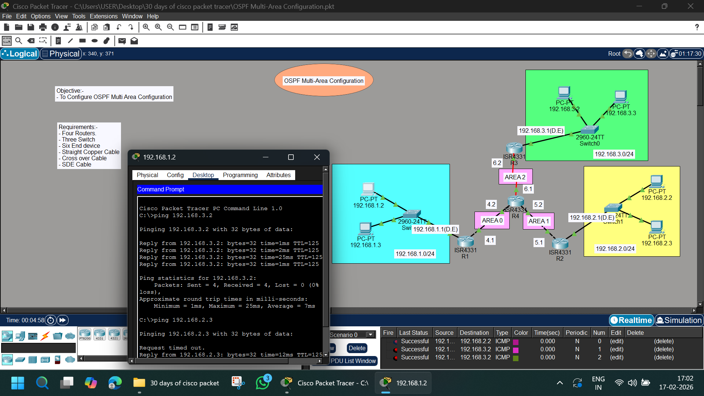

# 🖧 OSPF Multi-Area Configuration (Area 0, Area 1 & Area 2)



---

# 📌 Objective
To configure OSPF Multi-Area routing and verify full connectivity between all LAN networks across different OSPF areas.

---

# 🧰 Requirements
- 4 Routers (ISR4331)
- 3 Switches (2960-24TT)
- 6 PCs
- Straight Through Copper Cable
- Serial DCE Cable
- Cisco Packet Tracer

---

# 🌐 Network Overview

This lab consists of:

- 🔹 Area 0 (Backbone Area)
- 🔹 Area 1
- 🔹 Area 2
- 🔹 3 LAN Networks
- 🔹 4 Routers interconnected

---

# 🗂 IP Addressing Scheme

## 🔹 LAN Networks

| Network | Area | Gateway |
|---------|------|----------|
| 192.168.1.0/24 | Area 0 | 192.168.1.1 |
| 192.168.2.0/24 | Area 1 | 192.168.2.1 |
| 192.168.3.0/24 | Area 2 | 192.168.3.1 |

---

## 🔹 Serial Networks

| Connection | Network | Area |
|------------|----------|------|
| R1 – R4 | 192.168.4.0/24 | Area 0 |
| R4 – R2 | 192.168.5.0/24 | Area 1 |
| R4 – R3 | 192.168.6.0/24 | Area 2 |

---

# 💻 PC Configuration

## 🖥 LAN 1 (Area 0)
- PC1: 192.168.1.2 /24
- Gateway: 192.168.1.1

- PC2: 192.168.1.3 /24
- Gateway: 192.168.1.1


## 🖥 LAN 2 (Area 1)
- PC3: 192.168.2.2 /24
- Gateway: 192.168.2.1

- PC4: 192.168.2.3 /24
- Gateway: 192.168.2.1


## 🖥 LAN 3 (Area 2)
- PC5: 192.168.3.2 /24
- Gateway: 192.168.3.1

- PC6: 192.168.3.3 /24
- Gateway: 192.168.3.1


---

# ⚙️ Router Configuration

---

# 🔹 R1 (Area 0)

```bash
enable
configure terminal
hostname R1

interface g0/0/0
ip address 192.168.1.1 255.255.255.0
no shutdown

interface s0/1/0
ip address 192.168.4.1 255.255.255.0
clock rate 64000
no shutdown

router ospf 1
router-id 1.1.1.1
network 192.168.1.0 0.0.0.255 area 0
network 192.168.4.0 0.0.0.255 area 0

end
write memory
```

## 🔹 R2 (Area 1)
```bash
enable
configure terminal
hostname R2

interface g0/0/0
ip address 192.168.2.1 255.255.255.0
no shutdown

interface s0/1/0
ip address 192.168.5.2 255.255.255.0
no shutdown

router ospf 1
router-id 2.2.2.2
network 192.168.2.0 0.0.0.255 area 1
network 192.168.5.0 0.0.0.255 area 1

end
write memory
```

## 🔹 R3 (Area 2)
```bash
enable
configure terminal
hostname R3

interface g0/0/0
ip address 192.168.3.1 255.255.255.0
no shutdown

interface s0/1/0
ip address 192.168.6.2 255.255.255.0
no shutdown

router ospf 1
router-id 3.3.3.3
network 192.168.3.0 0.0.0.255 area 2
network 192.168.6.0 0.0.0.255 area 2

end
write memory
```

## 🔹 R4 (ABR – Area Border Router)
```bash
enable
configure terminal
hostname R4

interface s0/1/0
ip address 192.168.4.2 255.255.255.0
no shutdown

interface s0/1/1
ip address 192.168.5.1 255.255.255.0
clock rate 64000
no shutdown

interface s0/1/2
ip address 192.168.6.1 255.255.255.0
clock rate 64000
no shutdown

router ospf 1
router-id 4.4.4.4
network 192.168.4.0 0.0.0.255 area 0
network 192.168.5.0 0.0.0.255 area 1
network 192.168.6.0 0.0.0.255 area 2

end
write memory
```

## 🔍 Verification Commands
```bash
show ip ospf neighbor
show ip route
show ip ospf database
```

## ✅ Result

- ✔ OSPF Multi-Area configured successfully
- ✔ Area 0 functioning as Backbone
- ✔ R4 working as ABR
- ✔ Inter-Area routing working
- ✔ Full LAN-to-LAN connectivity achieved

## 📚 Concepts Covered

- OSPF Multi-Area
- Area 0 (Backbone Area)
- Area Border Router (ABR)
- OSPF Router ID
- Wildcard Mask
- Inter-Area Routing (O IA)
- OSPF Neighbor Adjacency

# 👨‍💻 Author

- Abhishek Pundir
- B.Tech Engineering Student
- Networking & Cybersecurity Enthusiast
- 30 Days of Cisco Packet Tracer Challenge 🚀
