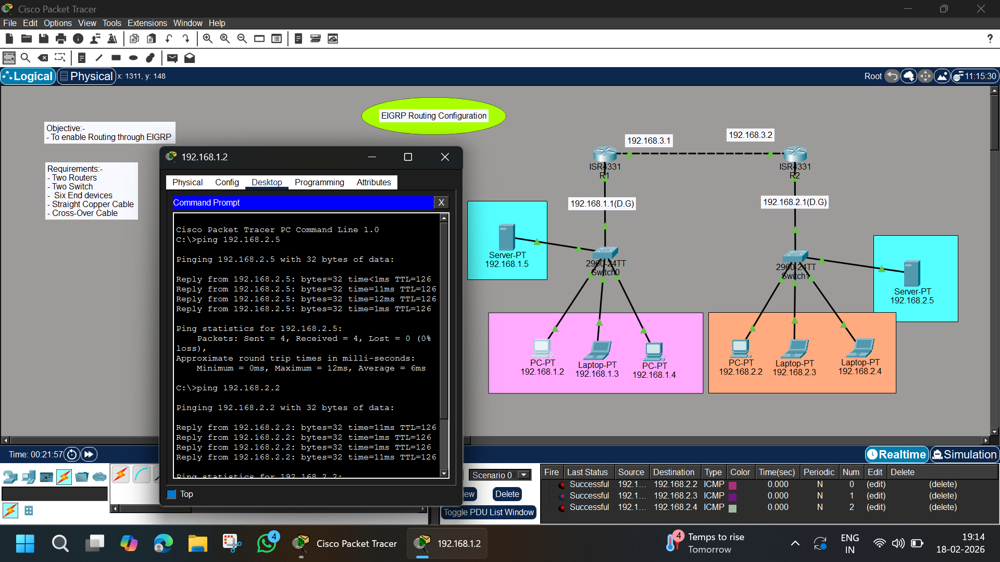

# 🟢 EIGRP Routing Configuration



---

# 📌 Objective
To enable dynamic routing between two routers using EIGRP and verify full connectivity between both LAN networks.

---

# 🧰 Requirements
- 2 Routers (ISR4331)
- 2 Switches (2960-24TT)
- 6 End Devices (PCs, Laptops, Servers)
- Straight Through Copper Cable
- Cross-Over Cable
- Cisco Packet Tracer

---

# 🌐 Network Overview

This topology consists of:

- 🔹 Two LAN Networks
- 🔹 Two Routers connected together
- 🔹 EIGRP enabled for dynamic routing
- 🔹 End-to-End connectivity testing

---

# 🗂 IP Addressing Scheme

## 🔹 LAN 1 – 192.168.1.0/24

| Device | IP Address | Default Gateway |
|--------|------------|----------------|
| R1 | 192.168.1.1 | — |
| PC1 | 192.168.1.2 | 192.168.1.1 |
| Laptop1 | 192.168.1.3 | 192.168.1.1 |
| PC2 | 192.168.1.4 | 192.168.1.1 |
| Server1 | 192.168.1.5 | 192.168.1.1 |

---

## 🔹 LAN 2 – 192.168.2.0/24

| Device | IP Address | Default Gateway |
|--------|------------|----------------|
| R2 | 192.168.2.1 | — |
| PC3 | 192.168.2.2 | 192.168.2.1 |
| Laptop2 | 192.168.2.3 | 192.168.2.1 |
| Laptop3 | 192.168.2.4 | 192.168.2.1 |
| Server2 | 192.168.2.5 | 192.168.2.1 |

---

## 🔹 Inter-Router Network

| Connection | Network |
|------------|----------|
| R1 – R2 | 192.168.3.0/24 |

R1 → 192.168.3.1  
R2 → 192.168.3.2  

---

# ⚙️ Router Configuration

---

# 🔹 R1 Configuration

```bash
enable
configure terminal
hostname R1

interface g0/0/0
ip address 192.168.1.1 255.255.255.0
no shutdown

interface g0/0/1
ip address 192.168.3.1 255.255.255.0
no shutdown

router eigrp 10
no auto-summary
network 192.168.1.0 0.0.0.255
network 192.168.3.0 0.0.0.255

end
write memory
```

#🔹 R2 Configuration
```bash
enable
configure terminal
hostname R2

interface g0/0/0
ip address 192.168.2.1 255.255.255.0
no shutdown

interface g0/0/1
ip address 192.168.3.2 255.255.255.0
no shutdown

router eigrp 10
no auto-summary
network 192.168.2.0 0.0.0.255
network 192.168.3.0 0.0.0.255

end
write memory
```

# 🔍 Verification Commands
```bash
show ip eigrp neighbors
show ip route
show ip protocols
```

# 📊 EIGRP Details

- Autonomous System Number: 10
- Metric Based On:
- Bandwidth
- Delay
- Protocol Type: Advanced Distance Vector
- Administrative Distance: 90 (Internal)

## ✅ Result

- ✔ EIGRP neighbor adjacency formed
- ✔ Routes dynamically exchanged
- ✔ No static routing required
- ✔ Full LAN-to-LAN communication successful

## 📚 Concepts Covered

- EIGRP Configuration
- Autonomous System (AS)
- EIGRP Neighbor Relationship
- No Auto-Summary
- Dynamic Routing
- Route Table Verification

# 👨‍💻 Author

- Abhishek Pundir
- B.Tech Engineering Student
- Networking & Cybersecurity Enthusiast
- 30 Days of Cisco Packet Tracer Challenge 🚀
