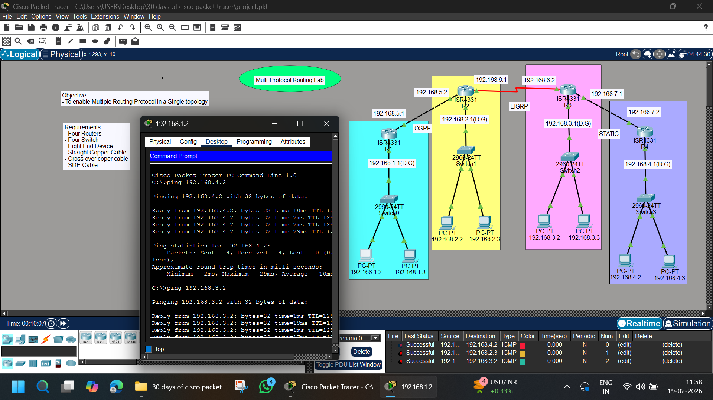

# 🌐 Multi-Protocol Routing Lab (OSPF + EIGRP + Static)



---

# 📌 Objective
To configure multiple routing protocols (OSPF, EIGRP, and Static Routing) in a single topology and ensure full end-to-end connectivity across all networks.

---

# 🧰 Requirements
- 4 Routers (ISR4331)
- 4 Switches (2960-24TT)
- 8 PCs
- Straight Through Copper Cable
- Cross-Over Cable
- Serial DCE Cable
- Cisco Packet Tracer

---

# 🌍 Network Overview

This lab consists of:

🔹 OSPF running between R1 and R2  
🔹 EIGRP running between R2 and R3  
🔹 Static Routing between R3 and R4  
🔹 4 Separate LAN Networks  
🔹 Inter-protocol connectivity  

---

# 🗂 IP Addressing Scheme

## 🔹 LAN Networks

| Router | LAN Network | Default Gateway |
|--------|------------|----------------|
| R1 | 192.168.1.0/24 | 192.168.1.1 |
| R2 | 192.168.2.0/24 | 192.168.2.1 |
| R3 | 192.168.3.0/24 | 192.168.3.1 |
| R4 | 192.168.4.0/24 | 192.168.4.1 |

---

## 🔹 Inter-Router Networks

| Connection | Network | Protocol |
|------------|----------|----------|
| R1 – R2 | 192.168.5.0/24 | OSPF |
| R2 – R3 | 192.168.6.0/24 | EIGRP |
| R3 – R4 | 192.168.7.0/24 | Static |

---

# 💻 PC Configuration

## LAN 1 – 192.168.1.0/24
- 192.168.1.2
- 192.168.1.3
- Gateway: 192.168.1.1


## LAN 2 – 192.168.2.0/24
- 192.168.2.2
- 192.168.2.3
- Gateway: 192.168.2.1


## LAN 3 – 192.168.3.0/24
- 192.168.3.2
- 192.168.3.3
- Gateway: 192.168.3.1


## LAN 4 – 192.168.4.0/24
- 192.168.4.2
- 192.168.4.3
- Gateway: 192.168.4.1


---

# ⚙️ Router Configuration

---

# 🔹 R1 – OSPF

```bash
enable
configure terminal
hostname R1

interface g0/0/0
ip address 192.168.1.1 255.255.255.0
no shutdown

interface g0/0/1
ip address 192.168.5.1 255.255.255.0
no shutdown

router ospf 1
router-id 1.1.1.1
network 192.168.1.0 0.0.0.255 area 0
network 192.168.5.0 0.0.0.255 area 0

end
write memory
```

# 🔹 R2 – OSPF + EIGRP (Redistribution Point)
```bash
enable
configure terminal
hostname R2

interface g0/0/0
ip address 192.168.2.1 255.255.255.0
no shutdown

interface g0/0/1
ip address 192.168.5.2 255.255.255.0
no shutdown

interface g0/0/2
ip address 192.168.6.1 255.255.255.0
no shutdown

router ospf 1
network 192.168.5.0 0.0.0.255 area 0

router eigrp 10
no auto-summary
network 192.168.2.0 0.0.0.255
network 192.168.6.0 0.0.0.255

end
write memory
```

# 🔹 R3 – EIGRP + Static
```bash
enable
configure terminal
hostname R3

interface g0/0/0
ip address 192.168.3.1 255.255.255.0
no shutdown

interface g0/0/1
ip address 192.168.6.2 255.255.255.0
no shutdown

interface g0/0/2
ip address 192.168.7.1 255.255.255.0
no shutdown

router eigrp 10
no auto-summary
network 192.168.6.0 0.0.0.255
network 192.168.3.0 0.0.0.255

ip route 192.168.4.0 255.255.255.0 192.168.7.2

end
write memory
```

# 🔹 R4 – Static Routing
```bash
enable
configure terminal
hostname R4

interface g0/0/0
ip address 192.168.4.1 255.255.255.0
no shutdown

interface g0/0/1
ip address 192.168.7.2 255.255.255.0
no shutdown

ip route 0.0.0.0 0.0.0.0 192.168.7.1

end
write memory
```

# 🔍 Verification Commands

- show ip route
- show ip ospf neighbor
- show ip eigrp neighbors
- show ip protocols

# 📊 Concepts Covered

- OSPF Configuration
- EIGRP Configuration
- Static Routing
- Default Route
- Multi-Protocol Network
- Inter-Protocol Communication
- Route Table Analysis

# ✅ Result

- ✔ OSPF working between R1–R2
- ✔ EIGRP working between R2–R3
- ✔ Static routing working between R3–R4
- ✔ Full end-to-end connectivity achieved
- ✔ All LANs can communicate successfully

# 👨‍💻 Author

- Abhishek Pundir
- B.Tech | Networking & CCNA Aspirant
- 30 Days of Cisco Packet Tracer Challenge 🚀
