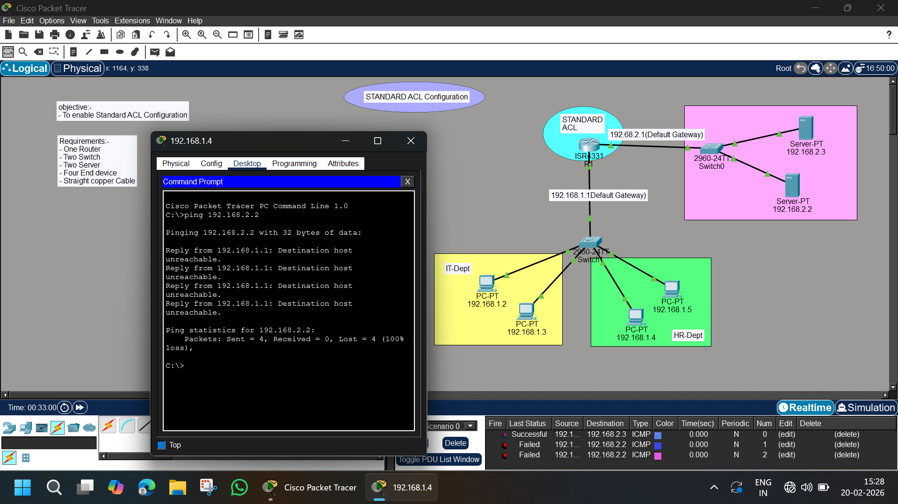

# 🔐 Standard ACL Configuration – Cisco Packet Tracer Lab

## 📌 Objective
To configure and verify Standard Access Control List (ACL) in Cisco Packet Tracer to control traffic between internal departments and servers.

---

## 🏗️ Network Topology



---

## 🧰 Requirements

- 1 Router (ISR 4331)
- 2 Switches (2960-24TT)
- 2 Servers
- 4 PCs
- Straight-through copper cables
- Cisco Packet Tracer

---

## 🌐 IP Addressing Scheme

### IT & HR Network – 192.168.1.0/24

| Device | IP Address | Default Gateway |
|--------|------------|----------------|
| PC1 | 192.168.1.2 | 192.168.1.1 |
| PC2 | 192.168.1.3 | 192.168.1.1 |
| PC3 | 192.168.1.4 | 192.168.1.1 |
| PC4 | 192.168.1.5 | 192.168.1.1 |

### Server Network – 192.168.2.0/24

| Device | IP Address | Default Gateway |
|--------|------------|----------------|
| Server1 | 192.168.2.2 | 192.168.2.1 |
| Server2 | 192.168.2.3 | 192.168.2.1 |

---

## 🛣️ Router Interface Configuration

```
enable
configure terminal

interface g0/0/0
ip address 192.168.1.1 255.255.255.0
no shutdown
exit

interface g0/0/1
ip address 192.168.2.1 255.255.255.0
no shutdown
exit
```

---

## 🔒 Standard ACL Configuration

### 🎯 Scenario:
Block PC 192.168.1.4 from accessing Server Network (192.168.2.0/24)

```
access-list 1 deny 192.168.1.4 0.0.0.0
access-list 1 permit any
```

---

## 📍 Apply ACL to Interface

(Standard ACL should be applied close to destination)

```
interface g0/0/1
ip access-group 1 out
exit
```

---

## 🧪 Testing & Verification

### From Blocked PC (192.168.1.4)

```
ping 192.168.2.2
```

Expected Output:
```
Destination host unreachable
```

### From Allowed PC (192.168.1.2)

```
ping 192.168.2.2
```

Expected Output:
```
Reply from 192.168.2.2
```

---

## 📊 Result Summary

| Source | Destination | Result |
|--------|------------|--------|
| 192.168.1.4 | 192.168.2.2 | ❌ Denied |
| 192.168.1.2 | 192.168.2.2 | ✅ Allowed |

---

## 📚 Concepts Covered

- Standard ACL (1–99)
- Wildcard mask
- Implicit deny rule
- ACL placement rules
- Basic routing
- Ping verification

---

## 📁 Project Structure

```
Standard-ACL-Lab/
│
├── README.md
├── image.png
└── Standard-ACL.pkt
```

---

## 👨‍💻 Author

Abhishek Pundir  
Engineering Student | Networking Enthusiast | CCNA Aspirant  

---

⭐ If you found this helpful, consider starring the repository!
