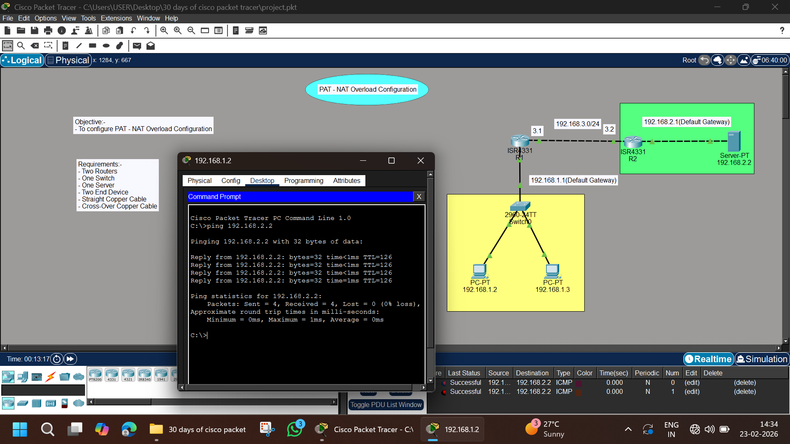

# 🌍 PAT (NAT Overload) Configuration – Cisco Packet Tracer Lab

## 📌 Objective
To configure **PAT (Port Address Translation) / NAT Overload** on a Cisco Router to allow multiple internal LAN devices to access an external server using a single public IP address.

---

## 🖼️ Network Topology



---

## 🏗️ Lab Requirements

- 2 Routers (ISR 4331)
- 1 Switch (2960-24TT)
- 1 Server
- 2 Client PCs
- Straight-through Copper Cable
- Cross-over Cable (Router-to-Router)
- Cisco Packet Tracer

---

## 🌐 IP Addressing Scheme

### 🔹 Internal LAN – 192.168.1.0/24

| Device | IP Address | Default Gateway |
|--------|------------|----------------|
| PC1 | 192.168.1.2 | 192.168.1.1 |
| PC2 | 192.168.1.3 | 192.168.1.1 |

Router R1 (Inside Interface):
```
192.168.1.1 /24
```

---

### 🔹 WAN Network – 192.168.3.0/24

| Device | IP Address |
|--------|------------|
| R1 | 192.168.3.1 |
| R2 | 192.168.3.2 |

---

### 🔹 Server Network – 192.168.2.0/24

| Device | IP Address | Default Gateway |
|--------|------------|----------------|
| Server | 192.168.2.2 | 192.168.2.1 |

Router R2 Interface:
```
192.168.2.1 /24
```

---

# ⚙️ Configuration Steps

---

## 🛣️ Step 1 – Configure R1 Interfaces

```
enable
configure terminal

interface g0/0/0
ip address 192.168.1.1 255.255.255.0
no shutdown
exit

interface g0/0/1
ip address 192.168.3.1 255.255.255.0
no shutdown
exit
```

---

## 🛣️ Step 2 – Configure R2 Interfaces

```
enable
configure terminal

interface g0/0/0
ip address 192.168.2.1 255.255.255.0
no shutdown
exit

interface g0/0/1
ip address 192.168.3.2 255.255.255.0
no shutdown
exit
```

---

## 🧭 Step 3 – Configure Static Routing

### On R1:
```
ip route 192.168.2.0 255.255.255.0 192.168.3.2
```

### On R2:
```
ip route 192.168.1.0 255.255.255.0 192.168.3.1
```

---

# 🔥 PAT (NAT Overload) Configuration on R1

---

## ✅ Step 4 – Create Access List for Internal Network

```
access-list 1 permit 192.168.1.0 0.0.0.255
```

---

## ✅ Step 5 – Define Inside & Outside Interfaces

```
interface g0/0/0
ip nat inside
exit

interface g0/0/1
ip nat outside
exit
```

---

## ✅ Step 6 – Configure NAT Overload

```
ip nat inside source list 1 interface g0/0/1 overload
```

---

# 🧪 Verification & Testing

From PC1 or PC2:

```
ping 192.168.2.2
```

### ✅ Expected Output:

```
Reply from 192.168.2.2: bytes=32 time<1ms TTL=126
Packets: Sent = 4, Received = 4, Lost = 0 (0% loss)
```

---

## 🔎 Verify NAT Table on R1

```
show ip nat translations
```

You should see internal private IPs translated to the public WAN interface IP (192.168.3.1).

---

# 📊 How PAT Works

- Multiple private IP addresses share **one public IP**
- Differentiation is done using **port numbers**
- Also called **NAT Overload**
- Commonly used in home and enterprise networks

---

# 📚 Concepts Covered

- Static Routing
- NAT Inside / Outside
- Access Control List (ACL 1)
- PAT (NAT Overload)
- Translation Table Verification
- End-to-End Connectivity Testing

---

# 📁 Project Structure

```
PAT-NAT-Lab/
│
├── README.md
├── image.png
└── PAT-NAT-Overload.pkt
```

---

# 🎯 Learning Outcome

✔ Understood difference between NAT and PAT  
✔ Configured NAT Overload  
✔ Verified translations using CLI  
✔ Implemented real-world internet simulation  

---

# 👨‍💻 Author

**Abhishek Pundir**  
Engineering Student | Networking Enthusiast | CCNA Aspirant  

---

⭐ If you found this project helpful, give it a star on GitHub!
