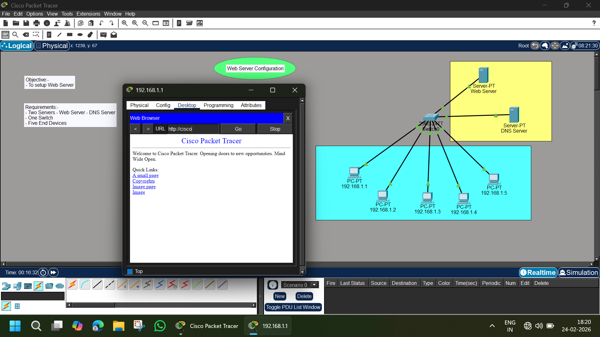

# 🌐 Web Server & DNS Server Configuration – Cisco Packet Tracer Lab

## 📌 Objective
To configure a **Web Server and DNS Server** in Cisco Packet Tracer and allow multiple client PCs to access the website using a domain name.

---

## 🖼️ Network Topology



---

## 🏗️ Lab Requirements

- 2 Servers (Web Server + DNS Server)
- 1 Switch (2960-24TT)
- 5 Client PCs
- Straight-through copper cables
- Cisco Packet Tracer

---

## 🌐 IP Addressing Scheme

### 🔹 LAN Network – 192.168.1.0/24

| Device | IP Address | Role |
|--------|------------|------|
| Web Server | 192.168.1.X | HTTP Service |
| DNS Server | 192.168.1.X | DNS Service |
| PC1 | 192.168.1.1 | Client |
| PC2 | 192.168.1.2 | Client |
| PC3 | 192.168.1.3 | Client |
| PC4 | 192.168.1.4 | Client |
| PC5 | 192.168.1.5 | Client |

> All devices are connected to a single switch.

---

# ⚙️ Configuration Steps

---

## 🖥️ Step 1 – Configure Web Server

1. Click on **Web Server**
2. Go to:
   ```
   Services → HTTP
   ```
3. Turn **HTTP Service ON**
4. Edit the default `index.html` page (optional)

Example HTML:
```
<html>
<head><title>My Network Website</title></head>
<body>
<h1>Welcome to My Cisco Web Server</h1>
<p>Web Server Successfully Configured!</p>
</body>
</html>
```

---

## 🌍 Step 2 – Configure DNS Server

1. Click on **DNS Server**
2. Go to:
   ```
   Services → DNS
   ```
3. Turn DNS Service **ON**
4. Add DNS Record:

| Name | Address |
|------|----------|
| cisco.com | Web Server IP |

Example:
```
Name: cisco.com
Address: 192.168.1.X (Web Server IP)
```

---

## 💻 Step 3 – Configure Client PCs

For each PC:

1. Go to:
   ```
   Desktop → IP Configuration
   ```
2. Assign:
   - IP Address
   - Subnet Mask: 255.255.255.0
   - DNS Server: (DNS Server IP)

Example:
```
DNS Server: 192.168.1.X
```

---

# 🧪 Testing & Verification

---

## ✅ Test 1 – Ping Web Server

From any PC:
```
ping 192.168.1.X
```

Expected Result:
```
Reply from 192.168.1.X
```

---

## ✅ Test 2 – Access Website Using Domain Name

On any PC:

1. Go to:
   ```
   Desktop → Web Browser
   ```
2. Enter:
   ```
   http://cisco.com
   ```

Expected Output:
- Website loads successfully
- DNS resolves domain to Web Server IP

---

# 🔎 How It Works

1. PC sends DNS query for `cisco.com`
2. DNS Server replies with Web Server IP
3. PC sends HTTP request to Web Server
4. Web Server responds with webpage

---

# 📚 Concepts Covered

- Web Server Configuration
- DNS Server Configuration
- HTTP Service
- Domain Name Resolution
- Client DNS Settings
- LAN Switching

---

# 📊 Result Summary

| Test | Result |
|------|--------|
| Ping Web Server | ✅ Success |
| Access via IP | ✅ Success |
| Access via Domain | ✅ Success |
| DNS Resolution | ✅ Working |

---

# 📁 Project Structure

```
Web-Server-Lab/
│
├── README.md
├── image.png
└── Web-Server-Config.pkt
```

---

# 🎯 Learning Outcome

✔ Understood how DNS resolves domain names  
✔ Configured HTTP service  
✔ Connected multiple clients to a web server  
✔ Simulated real-world website hosting in LAN  

---

# 👨‍💻 Author

**Abhishek Pundir**  
Engineering Student | Networking Enthusiast | CCNA Aspirant  

---

⭐ If you found this helpful, consider starring the repository!
