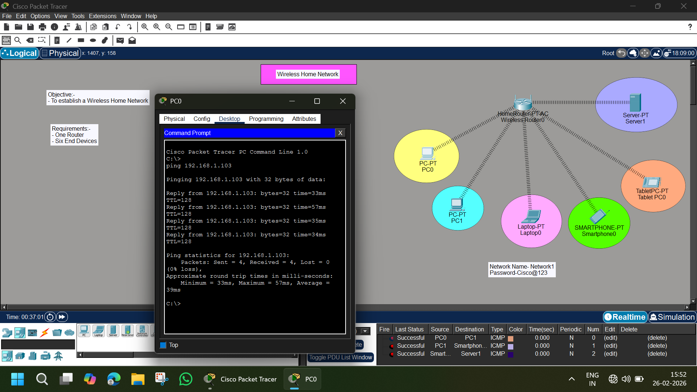

# 📡 Wireless Home Network – Cisco Packet Tracer Lab

## 📌 Objective
To design and configure a **Wireless Home Network** using a wireless router and multiple wireless end devices in Cisco Packet Tracer.

---

## 🖼️ Network Topology



---

## 🏗️ Lab Requirements

- 1 Wireless Router (HomeRouter-PT-AC)
- 1 Server
- 2 PCs
- 1 Laptop
- 1 Smartphone
- 1 Tablet
- Wireless connectivity

---

## 🌐 Network Details

| Component | Details |
|------------|----------|
| Network Name (SSID) | **Network1** |
| Security Type | WPA2-PSK |
| Password | **Cisco@123** |
| Network Type | Wireless LAN |
| IP Range | 192.168.1.0/24 |

---

# ⚙️ Configuration Steps

---

## 🛜 Step 1 – Configure Wireless Router

1. Click on **Wireless Router**
2. Go to:
   ```
   GUI → Wireless
   ```
3. Configure:
   - **SSID:** Network1
   - **Security Mode:** WPA2 Personal
   - **Passphrase:** Cisco@123
4. Save settings

5. Ensure DHCP is enabled:
   ```
   GUI → Setup → DHCP
   ```
   - DHCP: ON
   - Default IP: 192.168.1.1

---

## 💻 Step 2 – Connect Wireless Devices

For each device (PC, Laptop, Smartphone, Tablet):

1. Go to:
   ```
   Desktop → PC Wireless
   ```
2. Select network:
   ```
   Network1
   ```
3. Enter password:
   ```
   Cisco@123
   ```
4. Set IP Configuration to:
   ```
   DHCP
   ```

Devices will automatically receive IP addresses.

---

## 🖥️ Step 3 – Configure Server

1. Assign IP (Static or DHCP)
2. Verify connectivity
3. Enable required services if needed (HTTP/DNS optional)

---

# 🧪 Testing & Verification

---

## ✅ Test 1 – Ping Router

From PC Command Prompt:

```
ping 192.168.1.1
```

Expected Result:
```
Reply from 192.168.1.1
```

---

## ✅ Test 2 – Ping Server

Example:
```
ping 192.168.1.103
```

✔ Successful replies  
✔ 0% packet loss  

---

## ✅ Test 3 – Device-to-Device Communication

- PC ↔ Laptop
- PC ↔ Smartphone
- Smartphone ↔ Server

All devices should communicate successfully.

---

# 🔎 How It Works

1. Wireless Router acts as:
   - Access Point
   - DHCP Server
   - Default Gateway
2. Devices connect using SSID + Password
3. Router assigns IP addresses automatically
4. Devices communicate within same LAN

---

# 📊 Result Summary

| Test | Result |
|------|--------|
| Wireless Connection | ✅ Success |
| DHCP IP Assignment | ✅ Working |
| Ping Router | ✅ Success |
| Ping Server | ✅ Success |
| Inter-device Communication | ✅ Success |

---

# 📚 Concepts Covered

- Wireless Networking
- SSID Configuration
- WPA2 Security
- DHCP Configuration
- LAN Communication
- ICMP (Ping Testing)

---

# 📁 Project Structure

```
Wireless-Home-Network/
│
├── README.md
├── image.png
└── Wireless-Home-Network.pkt
```

---

# 🎯 Learning Outcome

✔ Configured a secure wireless network  
✔ Connected multiple wireless devices  
✔ Verified network communication  
✔ Understood DHCP and SSID configuration  

---

# 👨‍💻 Author

**Abhishek Pundir**  
Engineering Student | Networking Enthusiast | CCNA Aspirant  

---

⭐ If you found this helpful, consider starring the repository!
