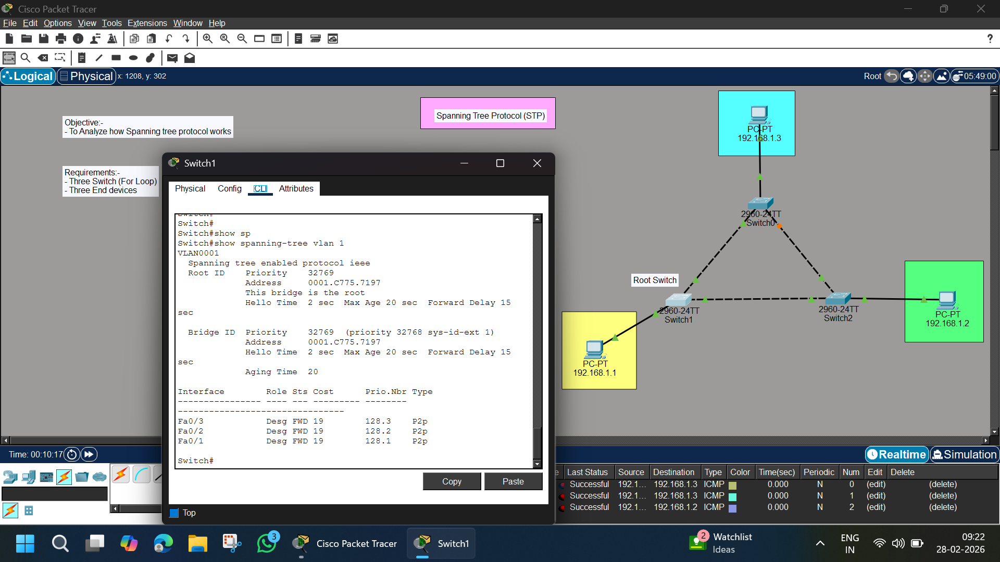

# 🌳 Spanning Tree Protocol (STP) – Cisco Packet Tracer Lab

## 📌 Objective
To analyze how **Spanning Tree Protocol (STP)** works in a Layer 2 network by creating a switching loop and observing how STP prevents broadcast storms.

---

## 🖼️ Network Topology



---

## 🏗️ Lab Requirements

- 3 × Cisco 2960 Switches
- 3 × PCs
- Copper straight-through cables
- Cisco Packet Tracer

---

## 🌐 Network Design

### 🔹 VLAN: 1 (Default)
### 🔹 Network: 192.168.1.0/24

| Device | IP Address |
|--------|------------|
| PC1 | 192.168.1.1 |
| PC2 | 192.168.1.2 |
| PC3 | 192.168.1.3 |

---

# 🧠 Concept Overview

When multiple switches are connected in a triangle topology, a **Layer 2 loop** is created.

Without STP:
- ❌ Broadcast storms
- ❌ MAC address table instability
- ❌ Network failure

With STP:
- ✅ Loop prevention
- ✅ One port is blocked
- ✅ Stable topology

---

# ⚙️ Configuration Steps

---

## 🖥️ Step 1 – Assign IP Addresses to PCs

On each PC:

```
Desktop → IP Configuration
```

Set:

- IP Address (as per table)
- Subnet Mask: 255.255.255.0
- Default Gateway: Not required (same VLAN)

---

## 🔌 Step 2 – Create Switching Loop

Connect switches in triangle:

- Switch0 ↔ Switch1
- Switch1 ↔ Switch2
- Switch2 ↔ Switch0

This creates a physical loop.

---

## 🌳 Step 3 – Verify STP on Switch

On any switch CLI:

```
enable
show spanning-tree vlan 1
```

---

## 🖥️ Sample Output Explanation

```
Spanning tree enabled protocol ieee
Root ID    Priority    32769
Address     0001.C775.7197
This bridge is the root
```

### 🔎 Important Fields:

| Field | Meaning |
|-------|---------|
| Root ID | Identifies Root Bridge |
| Priority | Default 32768 + VLAN ID |
| Address | MAC of Root Bridge |
| Hello Time | 2 seconds |
| Max Age | 20 seconds |
| Forward Delay | 15 seconds |

---

## 🔌 Port Roles

Example Output:

```
Interface  Role  Sts  Cost  Type
Fa0/3      Desg  FWD  19    P2p
Fa0/2      Desg  FWD  19    P2p
Fa0/1      Root  FWD  19    P2p
```

### Port Roles:

| Role | Meaning |
|------|----------|
| Root | Best path to Root Bridge |
| Designated | Forwarding port |
| Alternate | Blocking port |
| FWD | Forwarding State |
| BLK | Blocking State |

---

# 🧪 Testing & Verification

---

## ✅ Test 1 – Identify Root Bridge

Run:

```
show spanning-tree vlan 1
```

Look for:
```
This bridge is the root
```

Only one switch will show this.

---

## ✅ Test 2 – Check Blocked Port

One switch will show:

```
Role: Alternate
State: Blocking
```

This prevents the loop.

---

## ✅ Test 3 – Ping Between PCs

From PC1:

```
ping 192.168.1.2
ping 192.168.1.3
```

Expected Result:
- Successful replies
- No packet loss
- Stable network

---

# 🔎 How STP Works (Step-by-Step)

1. All switches send BPDU (Bridge Protocol Data Units)
2. Switch with lowest Bridge ID becomes Root Bridge
3. Each non-root switch selects Root Port
4. One redundant link is placed in Blocking state
5. Loop-free topology is formed

---

# 📊 Result Summary

| Feature | Status |
|----------|--------|
| Loop Created | ✅ Yes |
| STP Enabled | ✅ Default on 2960 |
| Root Bridge Elected | ✅ Yes |
| One Port Blocked | ✅ Yes |
| Network Stable | ✅ Yes |

---

# 📚 Commands Used

```
enable
show spanning-tree
show spanning-tree vlan 1
```

---

# 🧠 Key Learning Outcomes

✔ Understood why switching loops are dangerous  
✔ Observed Root Bridge election  
✔ Learned STP port roles  
✔ Verified blocking port behavior  
✔ Analyzed STP timers  

---

# 🔥 Advanced Practice (Optional)

Try:

### 🔹 Change Root Bridge Manually

```
conf t
spanning-tree vlan 1 priority 24576
```

Lower priority = Higher chance to become Root.

---

# 📁 Project Structure

```
STP-Lab/
│
├── README.md
├── image.png
└── Spanning Tree Protocol (STP).pkt
```

---

# 👨‍💻 Author

**Abhishek Pundir**  
Engineering Student | Networking Enthusiast | CCNA Aspirant  

---

# 🌟 If this lab helped you, consider starring the repository!
