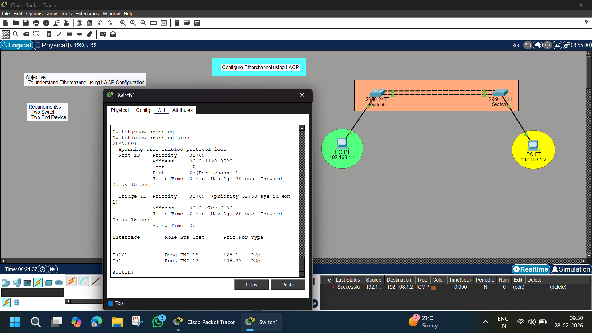

# 🔗 EtherChannel Configuration using LACP – Cisco Packet Tracer Lab

## 📌 Objective
To configure and verify **EtherChannel using LACP (Link Aggregation Control Protocol)** between two Cisco switches in order to increase bandwidth and provide link redundancy.

---

## 🖼️ Network Topology



---

## 🏗️ Lab Requirements

- 2 × Cisco 2960 Switches
- 2 × PCs
- 2 × FastEthernet links between switches
- Cisco Packet Tracer

---

## 🌐 Network Details

### 🔹 VLAN: 1 (Default)
### 🔹 Network: 192.168.1.0/24

| Device | IP Address |
|--------|------------|
| PC1 | 192.168.1.1 |
| PC2 | 192.168.1.2 |

---

# 🧠 Concept Overview

### 🔹 What is EtherChannel?

EtherChannel allows multiple physical links to be bundled into a single logical link called a **Port-Channel**.

### 🔹 Benefits:

- ✅ Increased bandwidth
- ✅ Load balancing
- ✅ Redundancy
- ✅ STP treats bundle as single link

---

# ⚙️ Configuration Steps

---

## 🖥️ Step 1 – Assign IP Addresses to PCs

On each PC:

```
Desktop → IP Configuration
```

Set:

- IP Address (as per table)
- Subnet Mask: 255.255.255.0
- Default Gateway: Not required (same VLAN)

---

## 🔌 Step 2 – Configure EtherChannel on Switch0

Enter CLI:

```
enable
configure terminal
```

Select interfaces (example Fa0/1 and Fa0/2):

```
interface range fa0/1 - 2
channel-group 1 mode active
exit
```

Configure Port-Channel:

```
interface port-channel 1
switchport mode access
exit
```

---

## 🔌 Step 3 – Configure EtherChannel on Switch1

Repeat the same commands:

```
enable
configure terminal
interface range fa0/1 - 2
channel-group 1 mode active
exit

interface port-channel 1
switchport mode access
exit
```

---

# 🔎 LACP Modes

| Mode | Description |
|------|------------|
| active | Actively negotiates LACP |
| passive | Responds to LACP |
| on | Forces channel (No LACP) |

In this lab, we use:

```
mode active
```

Which enables LACP negotiation.

---

# 🧪 Verification Commands

---

## ✅ Check EtherChannel Summary

```
show etherchannel summary
```

Expected Output:

```
Group  Port-channel  Protocol  Ports
1      Po1(SU)       LACP      Fa0/1(P) Fa0/2(P)
```

Where:
- **SU** = Layer 2 and in use
- **P** = Bundled in port-channel

---

## ✅ Verify Spanning Tree

```
show spanning-tree
```

You will see:

```
Port 27 (Port-channel1)
```

STP treats EtherChannel as one logical link.

---

## ✅ Test Connectivity

From PC1:

```
ping 192.168.1.2
```

Expected Result:
- Successful replies
- No packet loss

---

# 🔎 How It Works

1. LACP negotiates between switches
2. Physical links Fa0/1 & Fa0/2 are bundled
3. Logical interface created → Port-Channel1
4. STP sees only one logical link
5. Traffic is load balanced

---

# 📊 Result Summary

| Feature | Status |
|----------|--------|
| EtherChannel Created | ✅ Yes |
| LACP Enabled | ✅ Active Mode |
| Links Bundled | ✅ 2 |
| STP Stable | ✅ Yes |
| Ping Successful | ✅ Yes |

---

# 📚 Commands Used

```
interface range fa0/1 - 2
channel-group 1 mode active
interface port-channel 1
show etherchannel summary
show spanning-tree
```

---

# 🔥 Advanced Practice

### 🔹 Try Passive Mode

On one switch:

```
channel-group 1 mode passive
```

### 🔹 Force Root Bridge

```
spanning-tree vlan 1 priority 24576
```

### 🔹 Shut Down One Link

```
interface fa0/1
shutdown
```

Observe traffic continues via remaining link.

---

# 📁 Project Structure

```
EtherChannel-LACP-Lab/
│
├── README.md
├── image.png
└── EtherChannel-LACP.pkt
```

---

# 🎯 Learning Outcomes

✔ Understood EtherChannel concept  
✔ Configured LACP  
✔ Verified Port-Channel creation  
✔ Observed STP behavior with EtherChannel  
✔ Tested redundancy  

---

# 👨‍💻 Author

**Abhishek Pundir**  
Engineering Student | Networking Enthusiast | CCNA Aspirant  

---

# ⭐ If this lab helped you, consider starring the repository!
