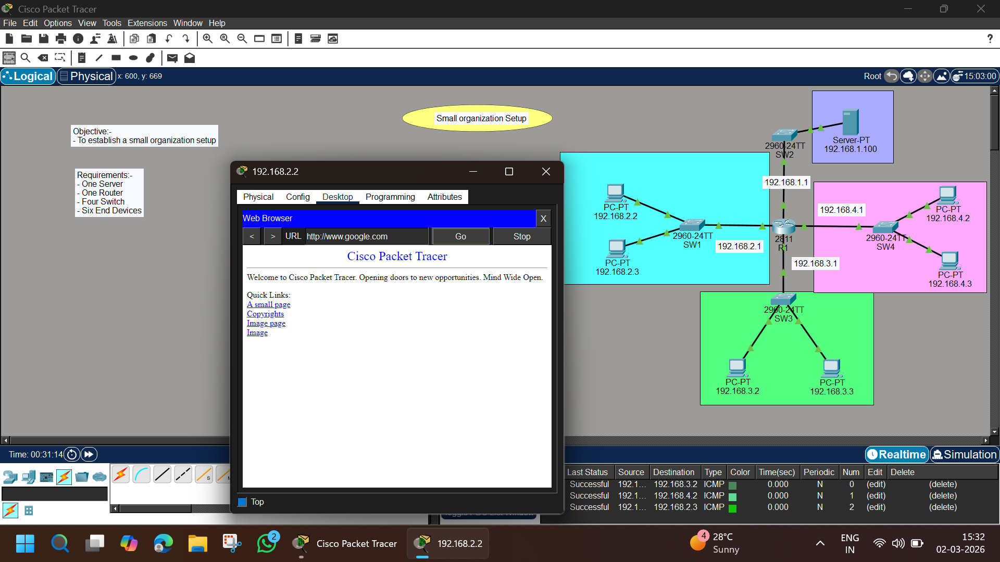

# 🏢 Small Organization Network Setup – Cisco Packet Tracer Lab

## 📌 Objective
To design and configure a **Small Organization Network** with multiple departments using a router for inter-network communication and verify end-to-end connectivity including server access.

---

## 🖼️ Network Topology



---

## 🏗️ Lab Requirements

- 1 × Router (2811)
- 1 × Server
- 4 × 2960 Switches
- 6 × PCs
- Copper Straight-through cables
- Cisco Packet Tracer

---

# 🌐 Network Design

The organization is divided into **four departments (subnets)** connected through a central router.

---

## 🔹 Subnet Details

### 🟦 Department 1 – 192.168.2.0/24
| Device | IP Address |
|--------|------------|
| PC1 | 192.168.2.2 |
| PC2 | 192.168.2.3 |
| Gateway | 192.168.2.1 |

---

### 🟩 Department 2 – 192.168.3.0/24
| Device | IP Address |
|--------|------------|
| PC3 | 192.168.3.2 |
| PC4 | 192.168.3.3 |
| Gateway | 192.168.3.1 |

---

### 🟪 Department 3 – 192.168.4.0/24
| Device | IP Address |
|--------|------------|
| PC5 | 192.168.4.2 |
| PC6 | 192.168.4.3 |
| Gateway | 192.168.4.1 |

---

### 🟨 Server Network – 192.168.1.0/24
| Device | IP Address |
|--------|------------|
| Server | 192.168.1.100 |
| Gateway | 192.168.1.1 |

---

# ⚙️ Configuration Steps

---

# 🖥️ Step 1 – Configure Router Interfaces

Enter Router CLI:

```
enable
configure terminal
```

Configure each interface:

```
interface fa0/0
ip address 192.168.2.1 255.255.255.0
no shutdown
exit

interface fa0/1
ip address 192.168.3.1 255.255.255.0
no shutdown
exit

interface fa1/0
ip address 192.168.4.1 255.255.255.0
no shutdown
exit

interface fa1/1
ip address 192.168.1.1 255.255.255.0
no shutdown
exit
```

---

# 💻 Step 2 – Configure PCs

For each PC:

```
Desktop → IP Configuration
```

Assign:
- IP Address (as per table)
- Subnet Mask: 255.255.255.0
- Default Gateway (Department gateway)

---

# 🖥️ Step 3 – Configure Server

1. Assign IP:
   ```
   IP Address: 192.168.1.100
   Subnet Mask: 255.255.255.0
   Default Gateway: 192.168.1.1
   ```

2. Enable HTTP service:
   ```
   Services → HTTP → ON
   ```

---

# 🧪 Testing & Verification

---

## ✅ Test 1 – Inter-Department Communication

From PC in Dept 1:

```
ping 192.168.3.2
ping 192.168.4.2
```

Expected:
✔ Successful replies

---

## ✅ Test 2 – Ping Server

```
ping 192.168.1.100
```

✔ Reply received

---

## ✅ Test 3 – Web Access

From any PC:

```
Desktop → Web Browser
http://192.168.1.100
```

Expected:
✔ Cisco Packet Tracer Webpage loads successfully

---

# 🔎 How It Works

1. Each department is in a separate subnet.
2. Router interfaces act as default gateways.
3. Router performs inter-network routing.
4. Server is accessible from all departments.
5. End-to-end communication is achieved.

---

# 📊 Result Summary

| Test | Status |
|------|--------|
| Router Configuration | ✅ Complete |
| Inter-Subnet Communication | ✅ Working |
| Server Reachability | ✅ Success |
| Web Access | ✅ Functional |

---

# 📚 Concepts Covered

- IP Addressing
- Subnetting
- Router Interface Configuration
- Inter-VLAN/Inter-Subnet Routing
- Default Gateway Configuration
- HTTP Server Testing
- ICMP (Ping Testing)

---

# 🔥 Advanced Practice

Try adding:

- 🔐 Access Control Lists (ACL)
- 🌐 DHCP Configuration
- 🌳 VLAN Implementation
- 🔗 Static or Dynamic Routing (RIP/OSPF)
- 🌍 Internet Simulation using NAT

---

# 📁 Project Structure

```
Small-Organization-Network/
│
├── README.md
├── image.png
└── Small-Org-Setup.pkt
```

---

# 🎯 Learning Outcomes

✔ Designed multi-department network  
✔ Configured router for inter-network communication  
✔ Verified connectivity using ping  
✔ Hosted and accessed a web server  
✔ Understood subnet-based network segmentation  

---

# 👨‍💻 Author

**Abhishek Pundir**  
Engineering Student | Networking Enthusiast | CCNA Aspirant  

---

⭐ If this lab helped you, consider starring the repository!
