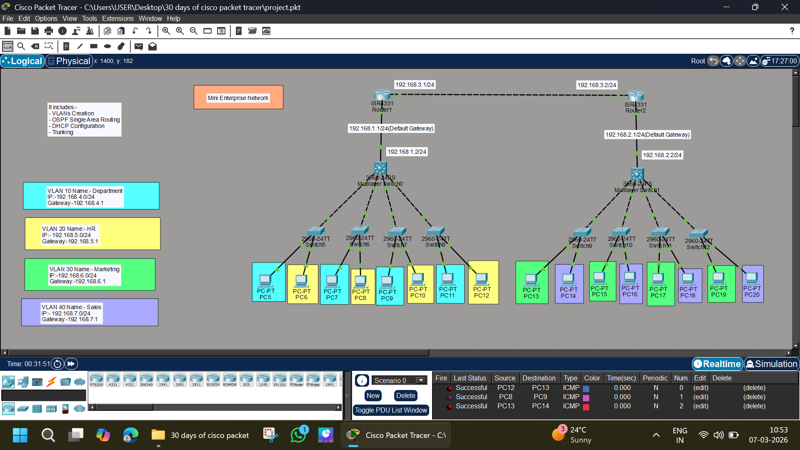

# 🏢 Mini Enterprise Network – Cisco Packet Tracer Project

## 📌 Project Overview

This project demonstrates the design and configuration of a **Mini Enterprise Network** using Cisco Packet Tracer.
The network simulates how a real organization separates departments using **VLANs**, enables **inter-VLAN routing**, and connects multiple networks using **OSPF routing protocol**.

The topology includes multiple switches, routers, and departmental VLANs to replicate a small enterprise infrastructure.

---

# 🎯 Objectives

* Implement **VLAN segmentation** for different departments
* Configure **Inter-VLAN routing** using a multilayer switch
* Implement **DHCP** for automatic IP assignment
* Configure **Trunking** between switches
* Establish **OSPF single-area routing** between routers
* Ensure connectivity across the entire enterprise network

---

# 🏗️ Network Topology



The network consists of:

* **2 Routers**
* **2 Multilayer Switches**
* **Multiple Access Switches**
* **20 End Devices (PCs)**
* **4 VLAN-based Departments**

Routers connect two separate LAN segments and exchange routes using **OSPF**.

---

# 🖥️ Devices Used

| Device              | Quantity |
| ------------------- | -------- |
| Routers (ISR4331)   | 2        |
| Multilayer Switches | 2        |
| Access Switches     | Multiple |
| PCs                 | 20       |

---

# 🌐 Network Addressing

## Router-to-Router Network

| Device  | IP Address     |
| ------- | -------------- |
| Router1 | 192.168.3.1/24 |
| Router2 | 192.168.3.2/24 |

---

# 🧩 VLAN Configuration

The network is divided into departments using VLANs.

| VLAN ID | Department    | Network        | Gateway     |
| ------- | ------------- | -------------- | ----------- |
| VLAN 10 | IT Department | 192.168.4.0/24 | 192.168.4.1 |
| VLAN 20 | HR            | 192.168.5.0/24 | 192.168.5.1 |
| VLAN 30 | Marketing     | 192.168.6.0/24 | 192.168.6.1 |
| VLAN 40 | Sales         | 192.168.7.0/24 | 192.168.7.1 |

Each VLAN isolates traffic while still allowing communication via routing.

---

# 🔀 Trunking

Trunk links are configured between:

* Multilayer switches
* Access switches

This allows multiple VLANs to pass through a single link using **802.1Q trunking**.

Example command:

```
interface g0/1
switchport mode trunk
```

---

# 🔁 Inter-VLAN Routing

Inter-VLAN routing is implemented using a **Multilayer Switch (Layer 3 Switch)**.

Example configuration:

```
interface vlan 10
ip address 192.168.4.1 255.255.255.0
no shutdown
```

Each VLAN interface acts as the **default gateway** for that department.

---

# 📡 OSPF Routing Configuration

Routers exchange routing information using **OSPF Single Area (Area 0)**.

Example configuration:

```
router ospf 1
network 192.168.1.0 0.0.0.255 area 0
network 192.168.2.0 0.0.0.255 area 0
network 192.168.3.0 0.0.0.255 area 0
```

OSPF ensures dynamic routing between both enterprise network segments.

---

# 📥 DHCP Configuration

DHCP is configured to automatically assign IP addresses to PCs in each VLAN.

Example DHCP pool:

```
ip dhcp pool VLAN10
network 192.168.4.0 255.255.255.0
default-router 192.168.4.1
```

Benefits:

* Automatic IP allocation
* Reduced manual configuration
* Scalable network management

---

# 🧪 Testing & Verification

Connectivity was verified using:

### Ping Tests

```
ping 192.168.4.x
ping 192.168.5.x
ping 192.168.6.x
ping 192.168.7.x
```

Results:

* Successful communication across VLANs
* Successful routing between routers
* DHCP assigned IP addresses correctly

---

# 📊 Key Features Implemented

✔ VLAN Segmentation
✔ Inter-VLAN Routing
✔ DHCP Address Allocation
✔ Trunking between Switches
✔ OSPF Dynamic Routing
✔ Enterprise Network Design

---

# 📁 Project Structure

```
mini-enterprise-network/
│
├── README.md
├── network-topology.png
└── mini-enterprise-network.pkt
```

---

# 🎓 Learning Outcomes

Through this project, the following networking concepts were practiced:

* Enterprise network design
* VLAN segmentation
* Layer 3 switching
* DHCP configuration
* Dynamic routing using OSPF
* Network troubleshooting and testing

---

# 👨‍💻 Author

**Abhishek Pundir**

Networking Enthusiast
Cisco Packet Tracer Labs

---

# ⭐ If you found this project useful, consider giving it a star!
